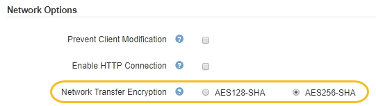

= 更改网络传输加密
:allow-uri-read: 
:icons: font
:imagesdir: ../media/

[role="lead"]
StorageGRID 系统使用传输层安全（ Transport Layer Security ， TLS ）保护网格节点之间的内部控制流量。网络传输加密选项用于设置 TLS 用于加密网格节点之间的控制流量的算法。此设置不会影响数据加密。

.您需要的内容
* 您必须使用支持的浏览器登录到网格管理器。
* 您必须具有特定的访问权限。

.关于此任务
默认情况下，网络传输加密使用 AES256-SHA 算法。此外，还可以使用 AES128-SHA 算法对控制流量进行加密。

.步骤
. 选择*配置**系统设置**网格选项*。
. 在网络选项部分中，将网络传输加密更改为 * AES128-SHA* 或 * AES256-SHA* （默认）。
+

. 单击 * 保存 * 。

