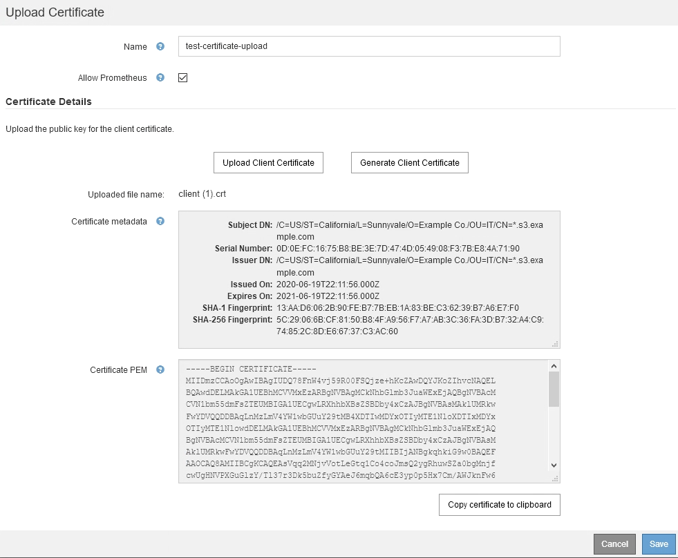
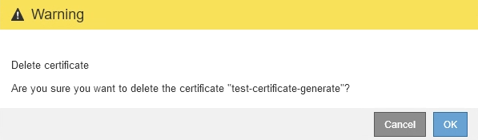

= 配置管理员客户端证书
:allow-uri-read: 
:icons: font
:imagesdir: ../media/

[role="lead"]
您可以使用客户端证书允许授权的外部客户端访问StorageGRID Prometheus数据库。客户端证书提供了一种使用外部工具监控StorageGRID 的安全方式。

如果您需要使用外部监控工具访问StorageGRID 、则必须使用网格管理器上传或生成客户端证书、并将证书信息复制到外部工具。

== 添加管理员客户端证书

要添加客户端证书、您可以提供自己的证书或使用网格管理器生成一个证书。

.您需要的内容
* 您必须具有 root 访问权限。
* 您必须使用支持的浏览器登录到网格管理器。
* 您必须知道管理节点的IP地址或域名。
* 您必须已配置StorageGRID 管理接口服务器证书并具有相应的CA包
* 如果要上传您自己的证书、则本地计算机上必须提供此证书的公有 密钥和专用密钥。

.步骤
. 在网格管理器中、选择*配置*>*访问控制*>*客户端证书*。
+
此时将显示客户端证书页面。

+
image::../media/certificates_page_admin_client.png[证书页面—管理客户端]

. 选择 * 添加 * 。
+
此时将显示上传证书页面。

+
image::../media/certificate_admin_upload.png[证书-Admin—上传]

. 键入一个介于1到32个字符之间的证书名称。
. 要使用外部监控工具访问Prometheus指标、请选中*允许Prometheus*复选框。
. 上传或生成证书：
+
.. 要上传证书、请转至 <<upload_cert,此处>>。
.. 要生成证书、请转至 <<generate_cert,此处>>。

. 要上传证书、请执行以下操作：
+
.. 选择*上传客户端证书*。
.. 浏览此证书的公有 密钥。
+
上传证书的公有 密钥后、系统将填充*证书元数据*和*证书PEM*字段。

+

.. 选择*将证书复制到剪贴板*、然后将证书粘贴到外部监控工具中。
.. 使用编辑工具将私钥复制并粘贴到外部监控工具中。
.. 选择*保存*以在网格管理器中保存证书。

. 要生成证书、请执行以下操作：
+
.. 选择*生成客户端证书*。
.. 输入管理节点的域名或IP地址。
.. (可选)输入一个X.509主题(也称为可分辨名称(Distinguished Name、DN))、以确定拥有证书的管理员。
.. (可选)选择证书的有效天数。默认值为730天。
.. 选择 * 生成 * 。
+
此时将填充*证书元数据*、*证书PEM*和*证书专用密钥*字段。

+
image::../media/certificate_admin_upload_generated.png[证书-管理员-已生成上传]

.. 选择*将证书复制到剪贴板*、然后将证书粘贴到外部监控工具中。
.. 选择*将私钥复制到剪贴板*、然后将密钥粘贴到外部监控工具中。
+

IMPORTANT: 关闭此对话框后、您将无法查看此私钥。将密钥复制到安全位置。

.. 选择*保存*以在网格管理器中保存证书。

. 在外部监控工具上配置以下设置，例如 Grafana 。
+
以下屏幕截图显示了一个 Grafana 示例：

+
image::../media/grafana_add_url_and_auth.png[Grafana —添加 URL 和身份验证]

+
.. * 名称 * ：输入连接的名称。
+
StorageGRID 不需要此信息，但您必须提供一个名称来测试连接。

.. * URL * ：输入管理节点的域名或 IP 地址。指定 HTTPS 和端口 9091 。
+
例如： `+https://admin-node.example.com:9091+`

.. 启用* TLS客户端授权*和*使用CA证书*。
.. 将管理接口服务器证书或CA捆绑包复制并粘贴到TLS/SSL身份验证详细信息下的"CA证书"中。
.. * 服务器名称 * ：输入管理节点的域名。
+
服务器名称必须与管理接口服务器证书中显示的域名匹配。

.. 保存并测试从 StorageGRID 或本地文件复制的证书和私钥。
+
现在，您可以使用外部监控工具从 StorageGRID 访问 Prometheus 指标。

+
有关指标的信息、请参见StorageGRID 监控和故障排除说明。

.相关信息
link:using-storagegrid-security-certificates.html["使用StorageGRID 安全证书"]

link:configuring-custom-server-certificate-for-grid-manager-tenant-manager.html["为网格管理器和租户管理器配置自定义服务器证书"]

link:../monitor/index.html["监控和放大；故障排除"]

== 编辑管理员客户端证书

您可以编辑证书以更改其名称、启用或禁用Prometheus访问、或者在当前证书已过期时上传新证书。

.您需要的内容
* 您必须具有 root 访问权限。
* 您必须使用支持的浏览器登录到网格管理器。
* 您必须知道管理节点的IP地址或域名。
* 如果您要上传新证书和私钥、它们必须在本地计算机上可用。

.步骤
. 选择*配置*>*访问控制*>*客户端证书*。
+
此时将显示客户端证书页面。此时将列出现有证书。

+
表中列出了证书到期日期。如果证书即将过期或已过期，则表中会显示一条消息并触发警报。

+
image::../media/certificate_admin_list.png[证书-管理员-列表]

. 选择要编辑的证书左侧的单选按钮。
. 选择 * 编辑 * 。
+
此时将显示编辑证书对话框。

+
image::../media/certificate_admin_edit.png[证书-管理员-编辑]

. 对证书进行所需的更改。
. 选择*保存*以在网格管理器中保存证书。
. 如果您上传了新证书：
+
.. 选择*将证书复制到剪贴板*将证书粘贴到外部监控工具。
.. 使用编辑工具将新的私钥复制并粘贴到外部监控工具中。
.. 在外部监控工具中保存并测试证书和私钥。

. 如果生成了新证书：
+
.. 选择*将证书复制到剪贴板*将证书粘贴到外部监控工具。
.. 选择*将私钥复制到剪贴板*将证书粘贴到外部监控工具。
+

IMPORTANT: 关闭此对话框后、您将无法查看或复制此私钥。将密钥复制到安全位置。

.. 在外部监控工具中保存并测试证书和私钥。

== 正在删除管理员客户端证书

如果您不再需要证书、可以将其删除。

.您需要的内容
* 您必须具有 root 访问权限。
* 您必须使用支持的浏览器登录到网格管理器。

.步骤
. 选择*配置*>*访问控制*>*客户端证书*。
+
此时将显示客户端证书页面。此时将列出现有证书。

+
image::../media/certificate_admin_list.png[证书-管理员-列表]

. 选择要删除的证书左侧的单选按钮。
. 选择 * 删除 * 。
+
此时将显示确认对话框。

+

. 选择 * 确定 * 。
+
此证书将被删除。

