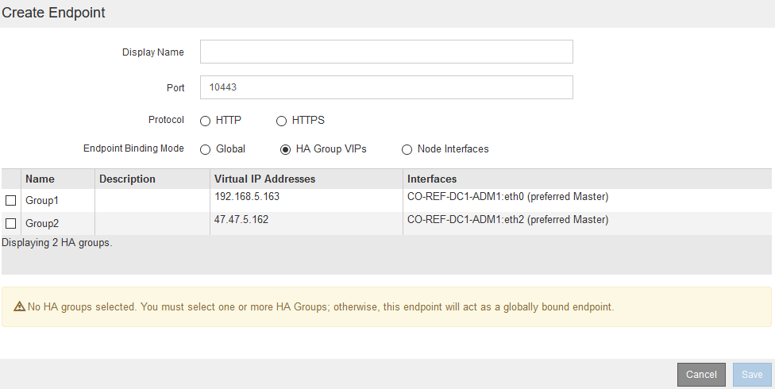

= 配置负载平衡器端点
:allow-uri-read: 
:icons: font
:imagesdir: ../media/

[role="lead"]
您可以创建、编辑和删除负载平衡器端点。

== 正在创建负载平衡器端点

每个负载平衡器端点都指定一个端口、一个网络协议(HTTP或HTTPS)和一个服务类型(S3或Swift)。如果创建HTTPS端点、则必须上传或生成服务器证书。

.您需要的内容
* 您必须具有 root 访问权限。
* 您必须使用支持的浏览器登录到网格管理器。
* 如果先前已重新映射要用于负载平衡器服务的端口、则必须已删除重新映射。
+

IMPORTANT: 如果已重新映射任何端口，则不能使用相同的端口配置负载平衡器端点。您可以使用重新映射的端口创建端点，但这些端点将重新映射到原始 CLB 端口和服务，而不是负载平衡器服务。按照恢复和维护说明中的步骤删除端口重新映射。

+

NOTE: CLB 服务已弃用。

.步骤
. 选择*配置*>*网络设置*>*负载平衡器端点*。
+
此时将显示负载平衡器端点页面。

+
image::../media/load_balancer_endpoints.png[负载平衡器端点]

. 选择*添加端点*。
+
此时将显示创建端点对话框。

+
image::../media/load_balancer_endpoint_create_http.png[创建 LB 端点]

. 输入端点的显示名称、此名称将显示在负载平衡器端点页面的列表中。
. 输入端口号、或者保留预先填充的端口号不变。
+
如果输入端口号80或443、则仅会在网关节点上配置端点、因为这些端口是在管理节点上保留的。

+

NOTE: 不允许其他网格服务使用的端口。有关用于内部和外部通信的端口列表、请参见网络连接准则。

. 选择* HTTP *或* HTTPS *以指定此端点的网络协议。
. 选择端点绑定模式。
+
** *全局*(默认)：可以通过指定端口号在所有网关节点和管理节点上访问此端点。
+
image::../media/load_balancer_endpoint_global_binding_mode.png[端点全局绑定模式]

** * HA组VIP*：只有为选定HA组定义的虚拟IP地址才能访问此端点。在此模式下定义的端点可以重复使用相同的端口号、只要这些端点定义的HA组不会彼此重叠。
+
选择包含要显示端点的虚拟IP地址的HA组。

+

** *节点接口*：仅可在指定节点和网络接口上访问此端点。在此模式下定义的端点可以重复使用相同的端口号、只要这些接口不会彼此重叠。
+
选择要显示端点的节点接口。

+
image::../media/load_balancer_endpoint_node_interfaces_binding_mode.png[端点节点接口绑定模式]

. 选择 * 保存 * 。
+
此时将显示编辑端点对话框。

. 选择* S3 *或* Swift*以指定此端点将提供的流量类型。
+
image::../media/load_balancer_endpoint_client_options.png[负载平衡器客户端]

. 如果选择了* HTTP *、请选择*保存*。
+
此时将创建不安全的端点。负载平衡器端点页面上的表列出了端点的显示名称、端口号、协议和端点ID。

. 如果选择了* HTTPS *并要上传证书、请选择*上传证书*。
+
image::../media/load_balancer_endpoint_upload_cert.png[上传证书]

+
.. 浏览服务器证书和证书专用密钥。
+
要使S3客户端能够使用S3 API端点域名进行连接、请使用与客户端可能用于连接到网格的所有域名匹配的多域或通配符证书。例如、服务器证书可能使用域名 `*._example_.com`。

+
link:configuring-s3-api-endpoint-domain-names.html["配置S3 API端点域名"]

.. 也可以浏览CA包。
.. 选择 * 保存 * 。
+
此时将显示端点的PEM编码证书数据。

. 如果选择了* HTTPS *并要生成证书、请选择*生成证书*。
+
image::../media/load_balancer_endpoint_generate_cert.png[生成证书]

+
.. 输入域名或IP地址。
+
您可以使用通配符表示运行负载平衡器服务的所有管理节点和网关节点的完全限定域名。例如： `*.sgws.foo.com` 使用*通配符表示 `gn1.sgws.foo.com` 和 `gn2.sgws.foo.com`。

+
link:configuring-s3-api-endpoint-domain-names.html["配置S3 API端点域名"]

.. 选择 ... image:../media/icon_plus_sign_black_on_white.gif["加号"] 以添加任何其他域名或IP地址。
+
如果您使用的是高可用性(HA)组、请添加HA虚拟IP的域名和IP地址。

.. (可选)输入一个X.509主题(也称为可分辨名称(Distinguished Name、DN))、以确定谁拥有此证书。
.. (可选)选择证书的有效天数。默认值为730天。
.. 选择 * 生成 * 。
+
此时将显示端点的证书元数据和PEM编码的证书数据。

. 单击 * 保存 * 。
+
此时将创建端点。负载平衡器端点页面上的表列出了端点的显示名称、端口号、协议和端点ID。

.相关信息
link:../maintain/index.html["保持并恢复()"]

link:../network/index.html["网络准则"]

link:managing-high-availability-groups.html["管理高可用性组"]

link:managing-untrusted-client-networks.html["管理不可信客户端网络"]

== 编辑负载平衡器端点

对于不安全的(HTTP)端点、您可以在S3和Swift之间更改端点服务类型。对于安全(HTTPS)端点、您可以编辑端点服务类型并查看或更改安全证书。

.您需要的内容
* 您必须具有 root 访问权限。
* 您必须使用支持的浏览器登录到网格管理器。

.步骤
. 选择*配置*>*网络设置*>*负载平衡器端点*。
+
此时将显示负载平衡器端点页面。表中列出了现有端点。

+
表中标识了证书即将过期的端点。

+
image::../media/load_balancer_endpoint_edit_or_remove.png[编辑端点]

. 选择要编辑的端点。
. 单击*编辑端点*。
+
此时将显示编辑端点对话框。

+
对于不安全的(HTTP)端点、仅会显示对话框的端点服务配置部分。对于安全(HTTPS)端点、此时将显示对话框的端点服务配置和证书部分、如以下示例所示。

+
image::../media/load_balancer_endpoint_edit.png[编辑负载平衡器端点]

. 对端点进行所需的更改。
+
对于不安全的(HTTP)端点、您可以：

+
** 在S3和Swift之间更改端点服务类型。
** 更改端点绑定模式。对于安全(HTTPS)端点、您可以：
** 在S3和Swift之间更改端点服务类型。
** 更改端点绑定模式。
** 查看安全证书。
** 当前证书到期或即将到期时、上传或生成新的安全证书。
+
选择一个选项卡以显示有关已上传的默认StorageGRID 服务器证书或CA签名证书的详细信息。

+

NOTE: 要更改现有端点的协议、例如从HTTP更改为HTTPS、必须创建一个新端点。按照说明创建负载平衡器端点、然后选择所需的协议。

. 单击 * 保存 * 。

.相关信息
<<正在创建负载平衡器端点>>

== 正在删除负载平衡器端点

如果您不再需要负载平衡器端点、可以将其删除。

.您需要的内容
* 您必须具有 root 访问权限。
* 您必须使用支持的浏览器登录到网格管理器。

.步骤
. 选择*配置*>*网络设置*>*负载平衡器端点*。
+
此时将显示负载平衡器端点页面。表中列出了现有端点。

+
image::../media/load_balancer_endpoint_edit_or_remove.png[编辑端点]

. 选择要删除的端点左侧的单选按钮。
. 单击*删除端点*。
+
此时将显示确认对话框。

+
image::../media/load_balancer_endpoint_confirm_removal.png[确认删除端点]

. 单击 * 确定 * 。
+
此端点将被删除。

