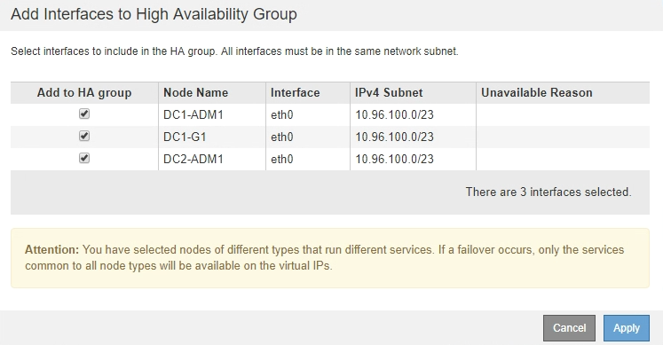

= 创建高可用性组
:allow-uri-read: 
:icons: font
:imagesdir: ../media/

[role="lead"]
您可以创建一个或多个高可用性(High Availability、HA)组、以提供对管理节点或网关节点上服务的高可用性访问。

.您需要的内容
* 您必须使用支持的浏览器登录到网格管理器。
* 您必须具有 root 访问权限。

.关于此任务
接口必须满足以下条件才能包含在HA组中：

* 接口必须用于网关节点或管理节点。
* 接口必须属于网格网络(eth0)或客户端网络(eth2)。
* 接口必须使用固定或静态IP地址配置、而不是使用DHCP配置。

.步骤
. 选择*配置*>*网络设置*>*高可用性组*。
+
此时将显示高可用性组页面。

+
image::../media/ha_groups_page_with_no_groups.png[HA组页面无组]

. 单击 * 创建 * 。
+
此时将显示创建高可用性组对话框。

. 键入HA组的名称、如果需要、还可以键入问题描述。
. 单击*选择接口*。
+
此时将显示向高可用性组添加接口对话框。此表列出了符合条件的节点、接口和IPv4子网。

+
image::../media/ha_group_add_interfaces.png[HA 组添加接口]

+
如果某个接口的IP地址是由DHCP分配的、则该接口不会显示在列表中。

. 在*添加到HA组*列中、选中要添加到HA组的接口对应的复选框。
+
请注意以下接口选择准则：

+
** 必须至少选择一个接口。
** 如果选择多个接口、则所有接口都必须位于网格网络(eth0)或客户端网络(eth2)上。
** 所有接口都必须位于同一子网中、或者位于具有通用前缀的子网中。
+
IP地址将限制为最小子网(前缀最大的子网)。

** 如果您在不同类型的节点上选择接口、并且发生了故障转移、则虚拟IP上只会提供选定节点通用的服务。
+
*** 选择两个或多个管理节点以保护网格管理器或租户管理器的HA。
*** 为负载平衡器服务的HA保护选择两个或更多管理节点、网关节点或两者。
*** 选择两个或更多网关节点以对CLB服务进行HA保护。
+

NOTE: CLB 服务已弃用。

+

. 单击 * 应用 * 。
+
您选择的接口将在创建高可用性组页面的接口部分中列出。默认情况下、列表中的第一个接口被选择为首选主接口。

+
image::../media/ha_group_select_virtual_ips.png[HA组选择虚拟IP]

. 如果要将其他接口作为首选主接口、请在*首选主接口*列中选择该接口。
+
首选主接口是活动接口、除非发生故障、导致VIP地址重新分配给备份接口。

+

NOTE: 如果HA组提供对网格管理器的访问权限、则必须选择主管理节点上的接口作为首选主节点。某些维护过程只能从主管理节点执行。

. 在页面的虚拟IP地址部分中、为HA组输入1到10个虚拟IP地址。单击加号(image:../media/icon_plus_sign_black_on_white_old.png["加号"])以添加多个IP地址。
+
您必须至少提供一个 IPv4 地址。您也可以指定其他 IPv4 和 IPv6 地址。

+
IPv4地址必须位于所有成员接口共享的IPv4子网内。

. 单击 * 保存 * 。
+
此时将创建 HA 组，您现在可以使用已配置的虚拟 IP 地址。

.相关信息
link:../rhel/index.html["安装 Red Hat Enterprise Linux 或 CentOS"]

link:../vmware/index.html["安装 VMware"]

link:../ubuntu/index.html["安装 Ubuntu 或 Debian"]

link:managing-load-balancing.html["管理负载平衡"]
