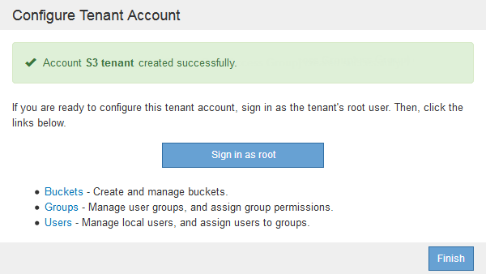

= 如果StorageGRID 未使用SSO、则创建租户帐户
:allow-uri-read: 
:icons: font
:imagesdir: ../media/

[role="lead"]
创建租户帐户时，您可以指定名称，客户端协议以及存储配额（可选）。如果StorageGRID 未使用单点登录(SSO)、则还必须指定租户帐户是否使用自己的身份源、并为租户的本地root用户配置初始密码。

.关于此任务
如果租户帐户将使用为网格管理器配置的身份源、并且您要将租户帐户的root访问权限授予某个联合组、则必须已将该联合组导入到网格管理器中。您无需为此管理员组分配任何 Grid Manager 权限。请参见的说明 link:managing-admin-groups.html["管理管理组"]。

.步骤
. 在*显示名称*文本框中、输入此租户帐户的显示名称。
+
显示名称不必唯一。创建租户帐户时、它会收到一个唯一的数字帐户ID。

. 选择此租户帐户要使用的客户端协议、可以是* S3或* Swift*。
. 对于S3租户帐户、请保持选中*允许平台服务*复选框、除非您不希望此租户对S3分段使用平台服务。
+
如果启用了平台服务，则租户可以使用 CloudMirror 复制等功能来访问外部服务。您可能需要禁用这些功能来限制租户使用的网络带宽或其他资源量。请 `M" 管理平台服务 " 。`

. 在*存储配额*文本框中、也可以输入要为此租户对象提供的最大GB、TB或PB数。然后、从下拉列表中选择单位。
+
如果希望此租户拥有无限配额、请将此字段留空。

+

NOTE: 租户的存储配额表示逻辑容量（对象大小），而不是物理容量（磁盘大小）。ILM副本和纠删编码不会影响所使用的配额量。如果超过配额、租户帐户将无法创建新对象。

+

NOTE: 要监控每个租户帐户的存储使用情况、请选择*使用情况*。租户帐户还可以通过租户管理器中的信息板或租户管理API监控自己的存储使用情况。请注意、如果节点与网格中的其他节点隔离、则租户的存储使用量值可能会过时。恢复网络连接后，总数将更新。

. 如果租户要管理自己的组和用户、请按照以下步骤进行操作。
+
.. 选中*使用自己的身份源*复选框(默认)。
+

NOTE: 如果选中此复选框、并且您要对租户组和用户使用身份联合、则租户必须配置自己的身份源。请参见有关使用租户帐户的说明。

.. 为租户的本地root用户指定密码。

. 如果租户要使用为网格管理器配置的组和用户、请按照以下步骤进行操作。
+
.. 取消选中*使用自己的身份源*复选框。
.. 执行以下操作之一或同时执行这两项操作：
+
*** 在根访问组字段中、从网格管理器中选择一个应具有租户初始根访问权限的现有联合组。
+

NOTE: 如果您拥有足够的权限、则在单击此字段时会列出网格管理器中的现有联合组。否则，请输入组的唯一名称。

*** 为租户的本地root用户指定密码。

. 单击 * 保存 * 。
+
此时将创建租户帐户。

. (可选)访问新租户。否则、请转至的步骤 <<STEP_SIGN_IN_LATER,稍后访问租户>>。
+
[cols="1a,2a"]
|===
| 如果您 ... | 执行此操作 ... 

 a| 
在受限端口上访问网格管理器
 a| 
单击*受限*了解有关访问此租户帐户的更多信息。

租户管理器的 URL 格式如下：

`https://_FQDN_or_Admin_Node_IP:port_/?accountId=_20-digit-account-id_/`

** `_FQDN_or_Admin_Node_IP_` 是完全限定域名或管理节点的IP地址
** `_port_` 是仅租户端口
** `_20-digit-account-id_` 是租户的唯一帐户ID

 a| 
在端口443上访问网格管理器、但未为本地root用户设置密码
 a| 
单击*登录*、然后输入root访问联合组中某个用户的凭据。

 a| 
通过端口443访问网格管理器、并为本地root用户设置密码
 a| 
转至下一步 <<STEP_SIGN_IN_AS_ROOT,以root用户身份登录>>。

|===
. 【step_sign_in_as_root]]以root身份登录到租户：
+
.. 在配置租户帐户对话框中、单击*以root身份登录*按钮。
+

+
此按钮上会显示一个绿色复选标记、表示您现在已以root用户身份登录到租户帐户。

+
image::../media/step_2_sign_in_as_root.gif[以root用户身份登录]

.. 单击链接以配置租户帐户。
+
每个链接都会在租户管理器中打开相应的页面。要完成此页面、请参见有关使用租户帐户的说明。

.. 单击 * 完成 * 。

. 要稍后访问租户、请执行以下操作：
+
[cols="1a,2a"]
|===
| 如果您使用的是 ... | 执行以下操作之一 ... 

 a| 
端口 443
 a| 
** 在网格管理器中、选择*租户*、然后单击租户名称右侧的*登录*。
** 在 Web 浏览器中输入租户的 URL ：
+
`https://_FQDN_or_Admin_Node_IP_/?accountId=_20-digit-account-id_/`

+
*** `_FQDN_or_Admin_Node_IP_` 是完全限定域名或管理节点的IP地址
*** `_20-digit-account-id_` 是租户的唯一帐户ID

 a| 
受限端口
 a| 
** 在网格管理器中、选择*租户*、然后单击*受限*。
** 在 Web 浏览器中输入租户的 URL ：
+
`https://_FQDN_or_Admin_Node_IP:port_/?accountId=_20-digit-account-id_`

+
*** `_FQDN_or_Admin_Node_IP_` 是完全限定域名或管理节点的IP地址
*** `_port_` 是仅限租户的受限端口
*** `_20-digit-account-id_` 是租户的唯一帐户ID

|===

.相关信息
link:controlling-access-through-firewalls.html["通过防火墙控制访问"]

link:managing-platform-services-for-s3-tenant-accounts.html["管理S3租户帐户的平台服务"]

link:../tenant/index.html["使用租户帐户"]
