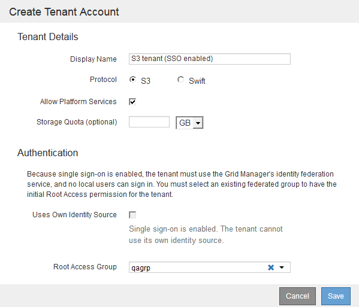

= 创建租户帐户
:allow-uri-read: 
:icons: font
:imagesdir: ../media/

[role="lead"]
您必须至少创建一个租户帐户，才能控制对 StorageGRID 系统中存储的访问。

.您需要的内容
* 您必须使用支持的浏览器登录到网格管理器。
* 您必须具有特定的访问权限。

.步骤
. 选择*租户*。
+
此时将显示租户帐户页面、并列出任何现有租户帐户。

+
image::../media/tenant_accounts_page_blank.png[租户帐户页面—空白]

. 选择 * 创建 * 。
+
此时将显示创建租户帐户页面。此页面中包含的字段取决于是否已为StorageGRID 系统启用单点登录(SSO)。

+
** 如果未使用SSO、则创建租户帐户页面将如下所示。
+
image::../media/create_tenant_account_no_sso.gif[已禁用创建租户帐户SSO]

** 如果启用了SSO、则创建租户帐户页面将如下所示。
+

.相关信息
link:using-identity-federation.html["使用身份联合"]

link:configuring-sso.html["配置单点登录"]
