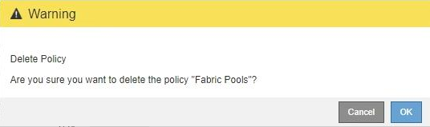

= 删除流量分类策略
:allow-uri-read: 
:icons: font
:imagesdir: ../media/

[role="lead"]
如果您不再需要流量分类策略，可以将其删除。

.您需要的内容
* 您必须使用支持的浏览器登录到网格管理器。
* 您必须具有 root 访问权限。

.步骤
. 选择*配置*>*网络设置*>*流量分类*。
+
此时将显示 " 流量分类策略 " 页面，并在表中列出现有策略。

+
image::../media/traffic_classification_policies_main_screen_w_examples.png[流量分类策略示例]

. 选择要删除的策略左侧的单选按钮。
. 单击 * 删除 * 。
+
此时将显示警告对话框。

+

. 单击*确定*确认要删除此策略。
+
此策略将被删除。

