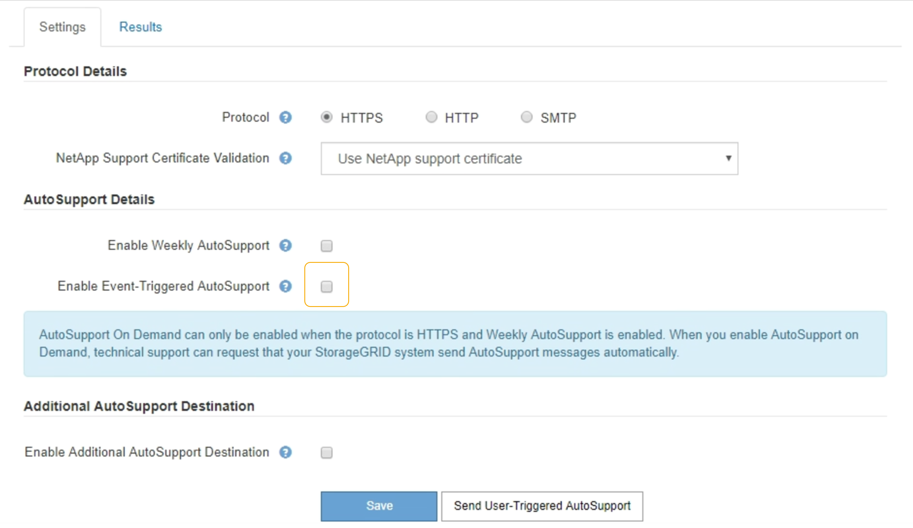

= 禁用事件触发的AutoSupport 消息
:allow-uri-read: 
:icons: font
:imagesdir: ../media/

[role="lead"]
默认情况下， StorageGRID 系统配置为在发生重要警报或其他重要系统事件时向 NetApp 支持发送 AutoSupport 消息。

.您需要的内容
* 您必须使用支持的浏览器登录到网格管理器。
* 您必须具有 " 根访问 " 或 " 其他网格配置 " 权限。

.关于此任务
您可以随时禁用事件触发的 AutoSupport 消息。

NOTE: 在系统范围内禁止电子邮件通知时，也会禁止显示事件触发的 AutoSupport 消息。(选择*配置**系统设置**显示选项*。然后，选择 * 通知禁止全部 * 。）

.步骤
. 选择*支持*>*工具*>* AutoSupport *。
+
此时将显示 AutoSupport 页面，并选择了 * 设置 * 选项卡。

. 清除*启用事件触发的AutoSupport *复选框。
+

. 选择 * 保存 * 。

