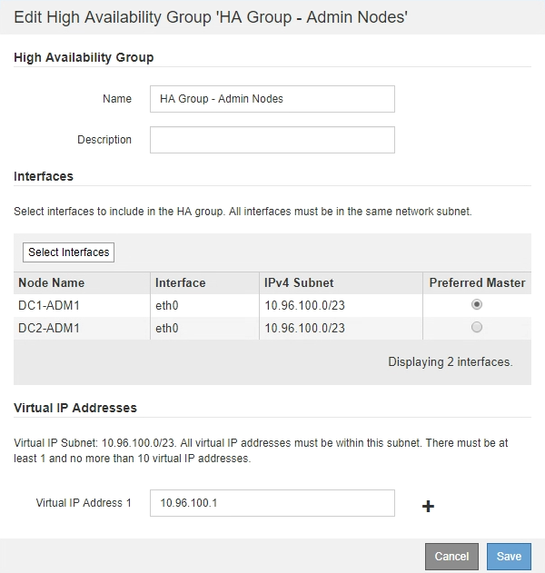

= 编辑高可用性组
:allow-uri-read: 
:icons: font
:imagesdir: ../media/

[role="lead"]
您可以编辑高可用性(High Availability、HA)组以更改其名称和问题描述 、添加或删除接口、或者添加或更新虚拟IP地址。

.您需要的内容
* 您必须使用支持的浏览器登录到网格管理器。
* 您必须具有 root 访问权限。

.关于此任务
编辑HA组的一些原因如下：

* 向现有组添加接口。接口IP地址必须与已分配给组的其他接口位于同一子网中。
* 从HA组中删除接口。例如、如果HA组中使用了网格网络或客户端网络的节点接口、则无法启动站点或节点停用操作步骤。

.步骤
. 选择*配置*>*网络设置*>*高可用性组*。
+
此时将显示高可用性组页面。

+
image::../media/ha_groups_page_with_two_groups.png[包含两个组的HA组页面]

. 选择要编辑的HA组、然后单击*编辑*。
+
此时将显示编辑高可用性组对话框。

. （可选）更新组的名称或问题描述 。
. 或者、也可以单击*选择接口*以更改HA组的接口。
+
此时将显示向高可用性组添加接口对话框。

+
image::../media/ha_group_add_interfaces.png[HA 组添加接口]

+
如果某个接口的IP地址是由DHCP分配的、则该接口不会显示在列表中。

. 选中或取消选中要添加或删除接口的复选框。
+
请注意以下接口选择准则：

+
** 必须至少选择一个接口。
** 如果选择多个接口、则所有接口都必须位于网格网络(eth0)或客户端网络(eth2)上。
** 所有接口都必须位于同一子网中、或者位于具有通用前缀的子网中。
+
IP地址将限制为最小子网(前缀最大的子网)。

** 如果您在不同类型的节点上选择接口、并且发生了故障转移、则虚拟IP上只会提供选定节点通用的服务。
+
*** 选择两个或多个管理节点以保护网格管理器或租户管理器的HA。
*** 为负载平衡器服务的HA保护选择两个或更多管理节点、网关节点或两者。
*** 选择两个或更多网关节点以对CLB服务进行HA保护。
+

NOTE: CLB 服务已弃用。

. 单击 * 应用 * 。
+
您选择的接口将在页面的接口部分中列出。默认情况下、列表中的第一个接口被选择为首选主接口。

+

. 如果要将其他接口作为首选主接口、请在*首选主接口*列中选择该接口。
+
首选主接口是活动接口、除非发生故障、导致VIP地址重新分配给备份接口。

+

NOTE: 如果HA组提供对网格管理器的访问权限、则必须选择主管理节点上的接口作为首选主节点。某些维护过程只能从主管理节点执行。

. (可选)更新HA组的虚拟IP地址。
+
您必须至少提供一个 IPv4 地址。您也可以指定其他 IPv4 和 IPv6 地址。

+
IPv4地址必须位于所有成员接口共享的IPv4子网内。

. 单击 * 保存 * 。
+
此时将更新HA组。

