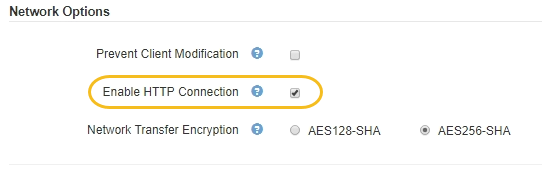

= 为客户端通信启用HTTP
:allow-uri-read: 
:icons: font
:imagesdir: ../media/

[role="lead"]
默认情况下，客户端应用程序会使用 HTTPS 网络协议连接到存储节点或网关节点上已弃用的 CLB 服务。您可以选择为这些连接启用 HTTP ，例如在测试非生产网格时。

.您需要的内容
* 您必须使用支持的浏览器登录到网格管理器。
* 您必须具有特定的访问权限。

.关于此任务
只有当 S3 和 Swift 客户端需要直接与存储节点或网关节点上已弃用的 CLB 服务建立 HTTP 连接时，才能完成此任务。

对于仅使用 HTTPS 连接的客户端或连接到负载平衡器服务的客户端，您无需完成此任务（因为您可以将每个负载平衡器端点配置为使用 HTTP 或 HTTPS ）。有关详细信息，请参见有关配置负载平衡器端点的信息。

请参见 link:summary-ip-addresses-and-ports-for-client-connections.html["摘要：客户端连接的 IP 地址和端口"] 了解使用 HTTP 或 HTTPS 连接到存储节点或已弃用的 CLB 服务时 S3 和 Swift 客户端使用的端口

IMPORTANT: 为生产网格启用 HTTP 时请务必小心，因为请求会以未加密方式发送。

.步骤
. 选择*配置**系统设置**网格选项*。
. 在网络选项部分中，选中 * 启用 HTTP 连接 * 复选框。
+

. 单击 * 保存 * 。

.相关信息
link:configuring-load-balancer-endpoints.html["配置负载平衡器端点"]

link:../s3/index.html["使用 S3"]

link:../swift/index.html["使用 Swift"]
