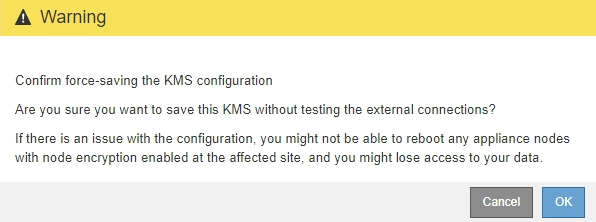

= 第 3 步：上传客户端证书
:allow-uri-read: 
:icons: font
:imagesdir: ../media/

[role="lead"]
在添加密钥管理服务器向导的第 3 步（上传客户端证书）中，您可以上传客户端证书和客户端证书专用密钥。客户端证书允许 StorageGRID 向 KMS 进行身份验证。

.步骤
. 从 * 步骤 3 （上传客户端证书） * 中，浏览到客户端证书的位置。
+
image::../media/kms_step_3_upload_client_certificate.png[Kms 步骤 3 上传客户端证书]

. 上传客户端证书文件。
+
此时将显示客户端证书元数据。

. 浏览到客户端证书的专用密钥位置。
. 上传私钥文件。
+
此时将显示客户端证书和客户端证书专用密钥的元数据。

+
image::../media/kms_step_3_client_certificate_metadata.png[Kms 步骤 3 客户端证书元数据]

. 选择 * 保存 * 。
+
测试密钥管理服务器与设备节点之间的连接。如果所有连接均有效，并且在 KMS 上找到正确的密钥，则新的密钥管理服务器将添加到密钥管理服务器页面上的表中。

+

NOTE: 添加 KMS 后，密钥管理服务器页面上的证书状态将立即显示为未知。StorageGRID 可能需要长达 30 分钟才能获取每个证书的实际状态。您必须刷新 Web 浏览器才能查看当前状态。

. 如果选择 * 保存 * 时显示错误消息，请查看消息详细信息，然后选择 * 确定 * 。
+
例如，如果连接测试失败，您可能会收到 422 ： Unprocessable Entity 错误。

. 如果需要保存当前配置而不测试外部连接，请选择 * 强制保存 * 。
+
image::../media/kms_force_save.png[Kms 强制保存]

+

IMPORTANT: 选择 * 强制保存 * 可保存 KMS 配置，但不会测试每个设备与该 KMS 的外部连接。如果具有此配置的问题描述 ，则可能无法重新启动受影响站点上已启用节点加密的设备节点。在问题解决之前，您可能无法访问数据。

. 查看确认警告，如果确实要强制保存配置，请选择 * 确定 * 。
+

+
已保存 KMS 配置，但未测试与 KMS 的连接。

