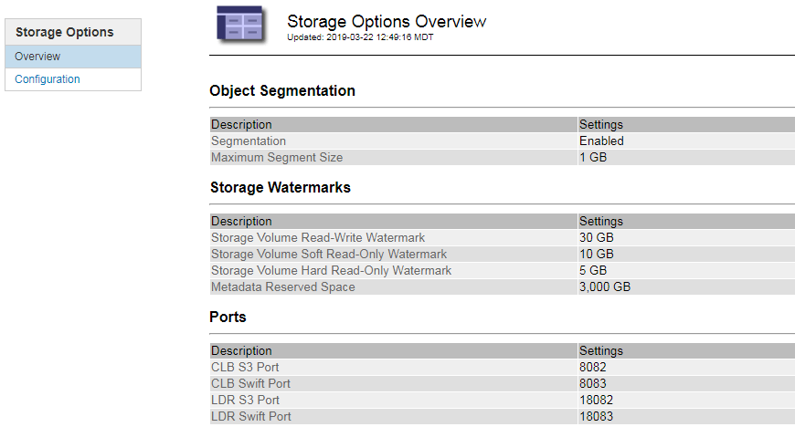

= 管理存储选项
:allow-uri-read: 
:icons: font
:imagesdir: ../media/

[role="lead"]
您可以使用网格管理器中的配置菜单查看和配置存储选项。存储选项包括对象分段设置和存储水印的当前值。您还可以查看网关节点上已弃用的 CLB 服务以及存储节点上的 LDR 服务使用的 S3 和 Swift 端口。

有关端口分配的信息、请参见 link:summary-ip-addresses-and-ports-for-client-connections.html["摘要：客户端连接的 IP 地址和端口"]。

