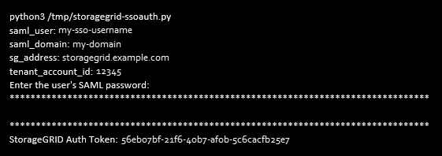

= 如果启用了单点登录、则使用API
:allow-uri-read: 
:icons: font
:imagesdir: ../media/

[role="lead"]
如果已为StorageGRID 系统启用单点登录(SSO)、则不能使用标准身份验证API请求登录和注销网格管理API或租户管理API。

== 如果启用了单点登录、请登录到API

如果已启用单点登录(SSO)、则必须对一系列API请求进行问题描述 处理、才能从AD FS获取对网格管理API或租户管理API有效的身份验证令牌。

.您需要的内容
* 您知道属于 StorageGRID 用户组的联合用户的 SSO 用户名和密码。
* 如果要访问租户管理 API ，您知道租户帐户 ID 。

.关于此任务
要获取身份验证令牌，可以使用以下示例之一：

* 。 `storagegrid-ssoauth.py` Python脚本、位于StorageGRID 安装文件目录中 (`./rpms` 对于Red Hat Enterprise Linux或CentOS、 `./debs` 适用于Ubuntu或Debian、和 `./vsphere` 适用于VMware)。
* cURL 请求的示例工作流。
+
如果执行速度过慢，则卷曲工作流可能会超时。您可能会看到以下错误：A valid SubjectConfirmation was not found on this response.

+

NOTE: 示例 cURL 工作流不会保护密码不会被其他用户看到。

如果您使用的是URL编码问题描述 、则可能会看到错误：不受支持的SAML版本。

.步骤
. 选择以下方法之一以获取身份验证令牌：
+
** 使用 `storagegrid-ssoauth.py` Python脚本。转至步骤 2 。
** 使用 curl 请求。转至步骤 3 。

. 如果要使用 `storagegrid-ssoauth.py` 脚本、将脚本传递给Python解释器并运行脚本。
+
出现提示时，输入以下参数的值：

+
** SSO 用户名
** 安装 StorageGRID 的域
** StorageGRID 的地址
** 如果要访问租户管理API、请输入租户帐户ID。+

+
输出中提供了 StorageGRID 授权令牌。现在，您可以将令牌用于其他请求，类似于在未使用 SSO 时使用 API 的方式。

. 如果要使用 curl 请求，请使用以下操作步骤 。
+
.. 声明登录所需的变量。
+
[listing]
----
export SAMLUSER='my-sso-username'
export SAMLPASSWORD='my-password'
export SAMLDOMAIN='my-domain'
export TENANTACCOUNTID=’12345’
export STORAGEGRID_ADDRESS='storagegrid.example.com'
export AD_FS_ADDRESS='adfs.example.com'
----
+

NOTE: 要访问网格管理API、请使用0作为 `TENANTACCOUNTID`。

.. 要接收签名身份验证URL、问题描述 请将POST请求发送到 `/api/v3/authorize-saml`、并从响应中删除其他JSON编码。
+
此示例显示了的已签名身份验证URL的POST请求 `TENANTACCOUNTID`。结果将传递到 python -m json.tool 以删除 JSON 编码。

+
[listing]
----
curl -X POST "https://$STORAGEGRID_ADDRESS/api/v3/authorize-saml" \
  -H "accept: application/json" -H  "Content-Type: application/json" \
  --data "{\"accountId\": \"$TENANTACCOUNTID\"}" | python -m json.tool
----
+
此示例的响应包括一个 URL 编码的签名 URL ，但不包括额外的 JSON 编码层。

+
[listing]
----
{
    "apiVersion": "3.0",
    "data": "https://adfs.example.com/adfs/ls/?SAMLRequest=fZHLbsIwEEV%2FJTuv7...sSl%2BfQ33cvfwA%3D&RelayState=12345",
    "responseTime": "2018-11-06T16:30:23.355Z",
    "status": "success"
}
----
.. 保存 `SAMLRequest` 从响应中获取、以便在后续命令中使用。
+
[listing]
----
export SAMLREQUEST='fZHLbsIwEEV%2FJTuv7...sSl%2BfQ33cvfwA%3D'
----
.. 从 AD FS 获取包含客户端请求 ID 的完整 URL 。
+
一种方法是使用上一响应中的 URL 请求登录表单。

+
[listing]
----
curl "https://$AD_FS_ADDRESS/adfs/ls/?SAMLRequest=$SAMLREQUEST&RelayState=$TENANTACCOUNTID" | grep 'form method="post" id="loginForm"'
----
+
此响应包括客户端请求 ID ：

+
[listing]
----
<form method="post" id="loginForm" autocomplete="off" novalidate="novalidate" onKeyPress="if (event && event.keyCode == 13) Login.submitLoginRequest();" action="/adfs/ls/?
SAMLRequest=fZHRToMwFIZfhb...UJikvo77sXPw%3D%3D&RelayState=12345&client-request-id=00000000-0000-0000-ee02-0080000000de" >
----
.. 保存响应中的客户端请求 ID 。
+
[listing]
----
export SAMLREQUESTID='00000000-0000-0000-ee02-0080000000de'
----
.. 将您的凭据发送到上一响应中的表单操作。
+
[listing]
----
curl -X POST "https://$AD_FS_ADDRESS/adfs/ls/?SAMLRequest=$SAMLREQUEST&RelayState=$TENANTACCOUNTID&client-request-id=$SAMLREQUESTID" \
  --data "UserName=$SAMLUSER@$SAMLDOMAIN&Password=$SAMLPASSWORD&AuthMethod=FormsAuthentication" --include
----
+
AD FS 返回 302 重定向，并在标题中显示追加信息 。

+

NOTE: 如果为 SSO 系统启用了多因素身份验证（ MFA ），则此表单发布还将包含第二个密码或其他凭据。

+
[listing]
----
HTTP/1.1 302 Found
Content-Length: 0
Content-Type: text/html; charset=utf-8
Location: https://adfs.example.com/adfs/ls/?SAMLRequest=fZHRToMwFIZfhb...UJikvo77sXPw%3D%3D&RelayState=12345&client-request-id=00000000-0000-0000-ee02-0080000000de
Set-Cookie: MSISAuth=AAEAADAvsHpXk6ApV...pmP0aEiNtJvWY=; path=/adfs; HttpOnly; Secure
Date: Tue, 06 Nov 2018 16:55:05 GMT
----
.. 保存 `MSISAuth` 响应中的cookie。
+
[listing]
----
export MSISAuth='AAEAADAvsHpXk6ApV...pmP0aEiNtJvWY='
----
.. 使用身份验证 POST 中的 Cookie 将 GET 请求发送到指定位置。
+
[listing]
----
curl "https://$AD_FS_ADDRESS/adfs/ls/?SAMLRequest=$SAMLREQUEST&RelayState=$TENANTACCOUNTID&client-request-id=$SAMLREQUESTID" \
  --cookie "MSISAuth=$MSISAuth" --include
----
+
响应标头将包含 AD FS 会话信息，以便日后注销时使用，而响应正文将 SAMLResponse 隐藏在一个格式的字段中。

+
[listing]
----
HTTP/1.1 200 OK
Cache-Control: no-cache,no-store
Pragma: no-cache
Content-Length: 5665
Content-Type: text/html; charset=utf-8
Expires: -1
Server: Microsoft-HTTPAPI/2.0
P3P: ADFS doesn't have P3P policy, please contact your site's admin for more details
Set-Cookie: SamlSession=a3dpbnRlcnMtUHJpbWFyeS1BZG1pbi0xNzgmRmFsc2Umcng4NnJDZmFKVXFxVWx3bkl1MnFuUSUzZCUzZCYmJiYmXzE3MjAyZTA5LThmMDgtNDRkZC04Yzg5LTQ3NDUxYzA3ZjkzYw==; path=/adfs; HttpOnly; Secure
Set-Cookie: MSISAuthenticated=MTEvNy8yMDE4IDQ6MzI6NTkgUE0=; path=/adfs; HttpOnly; Secure
Set-Cookie: MSISLoopDetectionCookie=MjAxOC0xMS0wNzoxNjozMjo1OVpcMQ==; path=/adfs; HttpOnly; Secure
Date: Wed, 07 Nov 2018 16:32:59 GMT

<form method="POST" name="hiddenform" action="https://storagegrid.example.com:443/api/saml-response">
  <input type="hidden" name="SAMLResponse" value="PHNhbWxwOlJlc3BvbnN...1scDpSZXNwb25zZT4=" /><input type="hidden" name="RelayState" value="12345" />
----
.. 保存 `SAMLResponse` 在隐藏字段中：
+
[listing]
----
export SAMLResponse='PHNhbWxwOlJlc3BvbnN...1scDpSZXNwb25zZT4='
----
.. 使用已保存的 `SAMLResponse`、创建StorageGRID``/api/saml-response`` 生成StorageGRID 身份验证令牌的请求。
+
适用于 `RelayState`、请使用租户帐户ID或如果要登录到网格管理API、请使用0。

+
[listing]
----
curl -X POST "https://$STORAGEGRID_ADDRESS:443/api/saml-response" \
  -H "accept: application/json" \
  --data-urlencode "SAMLResponse=$SAMLResponse" \
  --data-urlencode "RelayState=$TENANTACCOUNTID" \
  | python -m json.tool
----
+
响应包括身份验证令牌。

+
[listing]
----
{
    "apiVersion": "3.0",
    "data": "56eb07bf-21f6-40b7-af0b-5c6cacfb25e7",
    "responseTime": "2018-11-07T21:32:53.486Z",
    "status": "success"
}
----
.. 将响应中的身份验证令牌另存为 `MYTOKEN`。
+
[listing]
----
export MYTOKEN="56eb07bf-21f6-40b7-af0b-5c6cacfb25e7"
----
+
您现在可以使用 `MYTOKEN` 对于其他请求、类似于未使用SSO时使用API的方式。

== 如果启用了单点登录、则从API中注销

如果已启用单点登录（ Single Sign-On ， SSO ），则必须对一系列 API 请求进行问题描述 ，才能注销网格管理 API 或租户管理 API 。

.关于此任务
如果需要，只需从组织的单个注销页面注销即可注销 StorageGRID API 。或者，您也可以从 StorageGRID 触发单点注销（ SLO ），这需要有效的 StorageGRID 令牌。

.步骤
. 要生成签名注销请求、请传递 `cookie "sso=true"` 至SLO API：
+
[listing]
----
curl -k -X DELETE "https://$STORAGEGRID_ADDRESS/api/v3/authorize" \
-H "accept: application/json" \
-H "Authorization: Bearer $MYTOKEN" \
--cookie "sso=true" \
| python -m json.tool
----
+
返回注销 URL ：

+
[listing]
----
{
    "apiVersion": "3.0",
    "data": "https://adfs.example.com/adfs/ls/?SAMLRequest=fZDNboMwEIRfhZ...HcQ%3D%3D",
    "responseTime": "2018-11-20T22:20:30.839Z",
    "status": "success"
}
----
. 保存注销 URL 。
+
[listing]
----
export LOGOUT_REQUEST='https://adfs.example.com/adfs/ls/?SAMLRequest=fZDNboMwEIRfhZ...HcQ%3D%3D'
----
. 向注销 URL 发送请求以触发 SLO 并重定向回 StorageGRID 。
+
[listing]
----
curl --include "$LOGOUT_REQUEST"
----
+
返回 302 响应。此重定向位置不适用于纯 API 注销。

+
[listing]
----
HTTP/1.1 302 Found
Location: https://$STORAGEGRID_ADDRESS:443/api/saml-logout?SAMLResponse=fVLLasMwEPwVo7ss%...%23rsa-sha256
Set-Cookie: MSISSignoutProtocol=U2FtbA==; expires=Tue, 20 Nov 2018 22:35:03 GMT; path=/adfs; HttpOnly; Secure
----
. 删除 StorageGRID 承载令牌。
+
删除 StorageGRID 承载令牌的工作方式与不使用 SSO 相同。条件 `cookie "sso=true"` 如果未提供、则用户将从StorageGRID 中注销、而不会影响SSO状态。

+
[listing]
----
curl -X DELETE "https://$STORAGEGRID_ADDRESS/api/v3/authorize" \
-H "accept: application/json" \
-H "Authorization: Bearer $MYTOKEN" \
--include
----
+
答 `204 No Content` 响应指示用户现在已注销。

+
[listing]
----
HTTP/1.1 204 No Content
----

