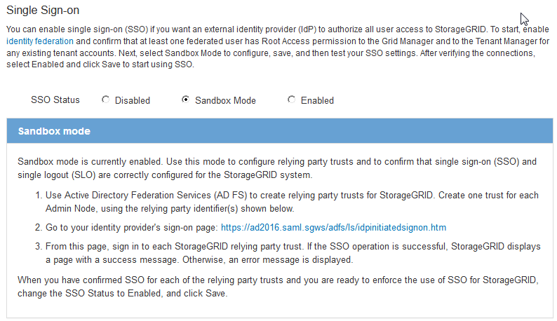

= 使用沙盒模式
:allow-uri-read: 
:icons: font
:imagesdir: ../media/

[role="lead"]
在为StorageGRID 用户强制实施单点登录(SSO)之前、您可以使用沙盒模式配置和测试依赖方信任的Active Directory联合身份验证服务(AD FS)。启用SSO后、您可以重新启用沙盒模式以配置或测试新的和现有的依赖方信任。重新启用沙盒模式会暂时禁用StorageGRID 用户的SSO。

.您需要的内容
* 您必须使用支持的浏览器登录到网格管理器。
* 您必须具有特定的访问权限。

.关于此任务
启用SSO后、如果用户尝试登录到管理节点、则StorageGRID 会向AD FS发送身份验证请求。反过来、AD FS会向StorageGRID 发送身份验证响应、指示授权请求是否成功。对于成功的请求、响应会为用户提供一个通用唯一标识符(UUID)。

要允许StorageGRID (服务提供商)和AD FS (身份提供程序)就用户身份验证请求进行安全通信、您必须在StorageGRID 中配置某些设置。接下来、您必须使用AD FS为每个管理节点创建依赖方信任。最后，您必须返回到 StorageGRID 以启用 SSO 。

使用沙盒模式，可以轻松执行此背面配置，并在启用 SSO 之前测试所有设置。

NOTE: 强烈建议使用沙盒模式、但严格地说、这并不是必需的。如果您准备在StorageGRID 中配置SSO后立即创建AD FS依赖方信任、您无需测试每个管理节点的SSO和单点注销(SLO)进程、单击*已启用*、输入StorageGRID 设置、为AD FS中的每个管理节点创建依赖方信任、然后单击*保存*以启用SSO。

.步骤
. 选择*配置**访问控制**单点登录*。
+
此时将显示 Single Sign-On 页面，并选择 * 已禁用 * 选项。

+
image::../media/sso_status_disabled.gif[已禁用 SSO 状态的单点登录页面]

+

NOTE: 如果未显示SSO状态选项、请确认您已将Active Directory配置为联合身份源。请参见"`使用单点登录的要求。`"

. 选择*沙盒模式*选项。
+
此时将显示身份提供程序和依赖方设置。在身份提供程序部分中、*服务类型*字段为只读。它显示了您正在使用的身份联合服务的类型(例如Active Directory)。

. 在身份提供程序部分中：
+
.. 输入与AD FS中显示的名称完全相同的联合服务名称。
+

NOTE: 要查找联合服务名称、请转到Windows Server Manager。选择*工具** AD FS管理*。从操作菜单中，选择 * 编辑联合身份验证服务属性 * 。联合服务名称显示在第二个字段中。

.. 指定在身份提供程序响应StorageGRID 请求发送SSO配置信息时是否要使用传输层安全(TLS)来保护连接。
+
*** * 使用操作系统 CA 证书 * ：使用操作系统上安装的默认 CA 证书确保连接安全。
*** * 使用自定义 CA 证书 * ：使用自定义 CA 证书确保连接安全。
+
如果选择此设置、请在* CA证书*文本框中复制并粘贴此证书。

*** * 请勿使用 TLS* ：请勿使用 TLS 证书来保护连接。

. 在依赖方部分中、指定在配置依赖方信任时要用于StorageGRID 管理节点的依赖方标识符。
+
** 例如、如果您的网格只有一个管理节点、并且您预计将来不会添加更多管理节点、请输入 `SG` 或 `StorageGRID`。
** 如果网格包含多个管理节点、请包含字符串 `[HOSTNAME]` 在标识符中。例如： `SG-[HOSTNAME]`。此操作将生成一个表、其中包含每个管理节点的依赖方标识符、该标识符基于节点的主机名。+注意：您必须为StorageGRID 系统中的每个管理节点创建依赖方信任。对每个管理节点拥有依赖方信任，可确保用户可以安全地登录和注销任何管理节点。

+
image::../media/sso_status_sandbox_mode.gif[单点登录,Sandbox mode enabled,Relying party identifiers shown for several Admin Nodes]

. 单击 * 保存 * 。
+
** 绿色复选标记将在 * 保存 * 按钮上显示几秒钟。
+
image::../media/save_button_green_checkmark.gif[带有绿色复选标记的保存按钮]

** 此时将显示沙盒模式确认通知、确认现在已启用沙盒模式。您可以在使用AD FS为每个管理节点配置依赖方信任并测试单点登录(SSO)和单点注销(SLO)进程时使用此模式。
+

.相关信息
link:requirements-for-sso.html["使用单点登录的要求"]
