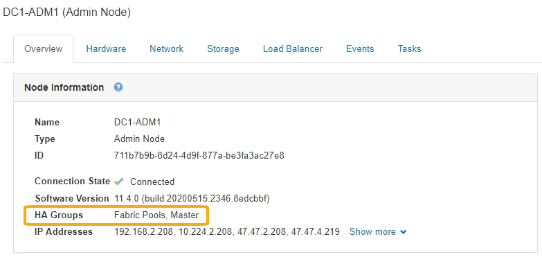

= 什么是HA组
:allow-uri-read: 
:icons: font
:imagesdir: ../media/

[role="lead"]
高可用性组使用虚拟IP地址(VIP)为网关节点或管理节点服务提供主动备份访问。

HA组由管理节点和网关节点上的一个或多个网络接口组成。创建HA组时、您可以选择属于网格网络(eth0)或客户端网络(eth2)的网络接口。HA组中的所有接口必须位于同一网络子网中。

HA组维护一个或多个虚拟IP地址、这些地址会添加到组中的活动接口中。如果活动接口不可用、则虚拟IP地址将移至另一个接口。此故障转移过程通常只需几秒钟，并且速度足以使客户端应用程序不会受到任何影响，并且可以依靠正常的重试行为继续运行。

HA组中的活动接口被指定为主接口。所有其他接口均指定为备份。要查看这些指定值、请选择*节点*>*节点_*>*概述*。

创建HA组时、您可以指定一个接口作为首选主接口。首选主接口是活动接口、除非发生故障、导致VIP地址重新分配给备份接口。解决故障后、VIP地址会自动移回首选主节点。

触发故障转移的原因如下：

* 配置接口的节点将关闭。
* 配置了该接口的节点与所有其他节点的连接至少断开2分钟
* 活动接口关闭。
* 负载平衡器服务将停止。
* 高可用性服务将停止。

NOTE: 托管活动接口的节点外部的网络故障可能不会触发故障转移。同样， CLB 服务（已弃用）或网格管理器或租户管理器服务失败也不会触发故障转移。

如果HA组包含来自两个以上节点的接口、则在故障转移期间、活动接口可能会移至任何其他节点的接口。
