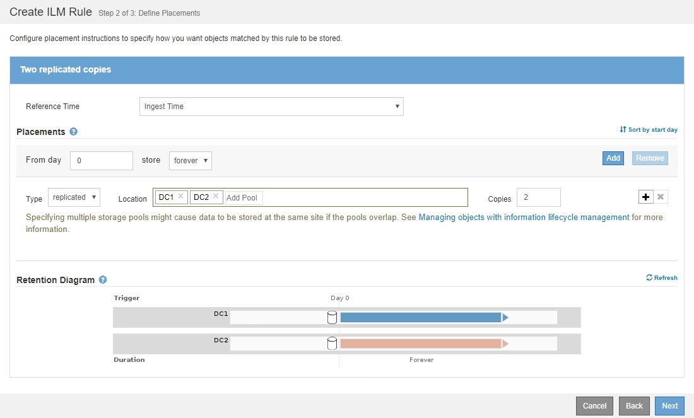

= 示例 2 ：用于 EC 对象大小筛选的 ILM 规则和策略
:allow-uri-read: 
:icons: font
:imagesdir: ../media/

[role="lead"]
您可以使用以下示例规则和策略作为起点来定义一个 ILM 策略，该策略按对象大小进行筛选以满足建议的 EC 要求。

CAUTION: 以下 ILM 规则和策略仅为示例。配置 ILM 规则的方法有多种。在激活新策略之前，请模拟建议的策略，以确认它将按预期工作，以防止内容丢失。

== ILM规则1示例2：对大于200 KB的所有对象使用EC

此示例ILM规则擦除将对大于200 KB (0.20 MB)的所有对象进行编码。

[cols="1a,2a"]
|===
| 规则定义 | 示例值 

 a| 
规则名称
 a| 
仅限EC对象>200 KB

 a| 
参考时间
 a| 
载入时间

 a| 
对对象大小进行高级筛选
 a| 
对象大小(MB)大于0.20

 a| 
内容放置
 a| 
使用三个站点创建 2+1 纠删编码副本

|===
image:../media/policy_2_rule_1_ec_objects_adv_filtering.gif["ILM规则1示例2：对大于200 KB的所有对象使用EC"]

放置说明指定使用所有三个站点创建2+1纠删编码副本。

image::../media/policy_2_rule_1_ec_objects_placements.png[ILM规则1示例2：对大于200 KB的所有对象使用EC]

== ILM 规则 2 示例 2 ：两个复制副本

此示例 ILM 规则将创建两个复制副本，而不按对象大小进行筛选。此规则是策略中的第二个规则。由于ILM规则1的示例2筛选出所有大于200 KB的对象、因此ILM规则2的示例2仅筛选200 KB或更小的适用场景 对象。

[cols="1a,2a"]
|===
| 规则定义 | 示例值 

 a| 
规则名称
 a| 
两个复制副本

 a| 
参考时间
 a| 
载入时间

 a| 
对对象大小进行高级筛选
 a| 
无

 a| 
内容放置
 a| 
创建两个复制副本并将其保存在两个数据中心 DC1 和 DC2 上

|===

== 示例2中的ILM策略：对大于200 KB的对象使用EC

在此示例策略中、大于200 KB的对象会进行纠删编码。系统会为所有其他对象创建两个复制副本。

此示例ILM策略包括以下ILM规则：

* 对大于200 KB的所有对象进行纠删编码。
* 如果对象与第一个ILM规则不匹配、请使用默认ILM规则为该对象创建两个复制副本。由于规则1已筛选出大于200 KB的对象、因此规则2仅筛选200 KB或更小的适用场景 对象。
+
image::../media/policy_2_configured_policy.png[示例2中的ILM策略：对大于200 KB的对象使用EC]

