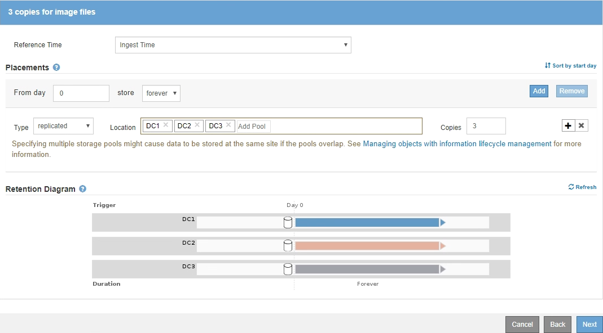

= 示例 3 ：用于更好地保护映像文件的 ILM 规则和策略
:allow-uri-read: 
:icons: font
:imagesdir: ../media/

[role="lead"]
您可以使用以下示例规则和策略来确保大于200 KB的映像进行纠删编码、并使用较小的映像创建三个副本。

CAUTION: 以下 ILM 规则和策略仅为示例。配置 ILM 规则的方法有多种。在激活新策略之前，请模拟建议的策略，以确认它将按预期工作，以防止内容丢失。

== ILM规则1、例如3：对大于200 KB的映像文件使用EC

此示例ILM规则使用高级筛选功能对大于200 KB的所有映像文件进行擦除代码。

[cols="1a,2a"]
|===
| 规则定义 | 示例值 

 a| 
规则名称
 a| 
EC映像文件> 200 KB

 a| 
参考时间
 a| 
载入时间

 a| 
用户元数据的高级筛选
 a| 
用户元数据类型等于映像文件

 a| 
对对象大小进行高级筛选
 a| 
对象大小(MB)大于0.2

 a| 
内容放置
 a| 
使用三个站点创建 2+1 纠删编码副本

|===
image:../media/policy_3_rule_1_ec_images_adv_filtering.gif["ILM规则1、例如3：对大于200 KB的映像文件使用EC"]

由于此规则已配置为策略中的第一条规则、因此纠删编码放置指令仅限大于200 KB的适用场景 映像。

image::../media/policy_2_rule_1_ec_objects_placements.png[ILM规则1、例如3：对大于200 KB的映像文件使用EC]

== ILM规则2示例3：为所有剩余映像文件复制3个副本

此示例ILM规则使用高级筛选来指定要复制的映像文件。

[cols="1a,2a"]
|===
| 规则定义 | 示例值 

 a| 
规则名称
 a| 
3个映像文件副本

 a| 
参考时间
 a| 
载入时间

 a| 
用户元数据的高级筛选
 a| 
用户元数据类型等于映像文件

 a| 
内容放置
 a| 
在所有存储节点中创建3个复制副本

|===
image:../media/policy_3_rule_2_copies_for_images_adv_filtering.gif["ILM规则2示例3：为所有剩余映像文件复制3个副本"]

由于策略中的第一个规则已与大于200 KB的映像文件匹配、因此这些放置说明仅适用于200 KB或更小的映像文件。

== 示例 3 中的 ILM 策略：更好地保护映像文件

在此示例中、ILM策略使用三个ILM规则创建一个策略、对大于200 KB (0.2 MB)的映像文件进行擦除编码、为200 KB或更小的映像文件创建复制副本、并为任何非映像文件创建两个复制副本。

此示例ILM策略包含执行以下操作的规则：

* 对大于200 KB的所有映像文件进行擦除编码。
* 为其余任何映像文件创建三个副本(即200 KB或更小的映像)。
* 将默认规则应用于任何剩余对象(即所有非映像文件)。

image::../media/policy_3_configured_policy.gif[示例 3 中的 ILM 策略：更好地保护映像文件]
