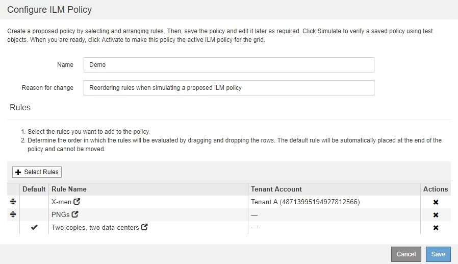

= 模拟ILM策略的示例
:allow-uri-read: 
:icons: font
:imagesdir: ../media/

[role="lead"]
以下示例显示了如何在激活ILM策略之前通过模拟ILM策略来验证ILM规则。

== 示例1：模拟建议的ILM策略时验证规则

此示例显示了在模拟建议的策略时如何验证规则。

在此示例中，正在针对两个分段中的输入对象模拟 * 示例 ILM 策略 * 。此策略包括三个规则，如下所示：

* 第一条规则 * 两个副本，即 bucket-A* 两年，仅适用于 bucket-a 中的对象
* 第二个规则菜单：EC objects_1 MB]、适用场景 all b桶but filters on objects大于1 MB。
* 第三个规则是默认规则、不包含任何筛选器。

image::../media/saved_policy_for_simulation.png[已保存模拟策略]

.步骤
. 添加规则并保存策略后、单击*模拟*。
+
此时将显示模拟 ILM 策略对话框。

. 在*对象*字段中、输入测试对象的S3存储分段/对象密钥或Swift容器/对象名称、然后单击*模拟*。
+
此时将显示模拟结果，其中显示了策略中与您测试的每个对象匹配的规则。

+
image::../media/simulate_policy_screen.png[模拟策略屏幕]

. 确认每个对象均已使用正确的规则进行匹配。
+
在此示例中：

+
.. `bucket-a/bucket-a object.pdf` 已正确匹配第一个规则、此规则会对中的对象进行筛选 `bucket-a`。
.. `bucket-b/test object greater than 1 MB.pdf` 位于中 `bucket-b`、因此与第一条规则不匹配。而是通过第二条规则正确匹配，该规则会对大于 1 MB 的对象进行筛选。
.. `bucket-b/test object less than 1 MB.pdf` 与前两个规则中的筛选器不匹配、因此将由默认规则放置、该规则不包含任何筛选器。

== 示例 2 ：模拟建议的 ILM 策略时对规则重新排序

此示例显示了在模拟策略时如何重新排列规则以更改结果。

在此示例中，正在模拟 * 演示 * 策略。此策略用于查找具有 series=x-men 用户元数据的对象，它包含以下三个规则：

* 第一个规则* PNGS*用于筛选以结尾的密钥名称 `.png`。
* 第二个规则* X-men*仅适用于租户A和筛选器的对象 `series=x-men` 用户元数据。
* 最后一条规则 * 两个副本两个数据中心 * 是默认规则，它匹配与前两个规则不匹配的任何对象。

image::../media/simulate_reorder_rules_pngs_rule.png[示例 2 ：模拟建议的 ILM 策略时对规则重新排序]

.步骤
. 添加规则并保存策略后、单击*模拟*。
. 在*对象*字段中、输入测试对象的S3存储分段/对象密钥或Swift容器/对象名称、然后单击*模拟*。
+
此时将显示模拟结果、并显示 `Havok.png` 对象已与* PNGS*规则匹配。

+
image::../media/simulate_reorder_rules_pngs_result.gif[示例 2 ：模拟建议的 ILM 策略时对规则重新排序]

+
但是、所使用的规则 `Havok.png` 用于测试的对象是* X-men*规则。

. 要解析问题描述 ，请对规则重新排序。
+
.. 单击*完成*以关闭模拟ILM策略页面。
.. 单击*编辑*以编辑此策略。
.. 将 *X-men* 规则拖动到列表顶部。
+

.. 单击 * 保存 * 。

. 单击*模拟*。
+
系统会根据更新后的策略重新评估先前测试的对象，并显示新的模拟结果。在此示例中、"规则匹配"列显示 `Havok.png` 现在、对象将按预期匹配X-men元数据规则。上一个匹配列显示 PNGs 规则与上一个模拟中的对象匹配。

+
image::../media/simulate_reorder_rules_correct_result.gif[示例 2 ：模拟建议的 ILM 策略时对规则重新排序]

+

NOTE: 如果您停留在配置策略页面上，则可以在进行更改后重新模拟策略，而无需重新输入测试对象的名称。

== 示例 3 ：模拟建议的 ILM 策略时更正规则

此示例显示了如何模拟策略，更正策略中的规则以及继续模拟。

在此示例中，正在模拟 * 演示 * 策略。此策略用于查找具有的对象 `series=x-men` 用户元数据。但是、在使用模拟此策略时会出现意外结果 `Beast.jpg` 对象。该对象与默认规则匹配，而不是与 X-men 元数据规则匹配，而是复制两个数据中心。

image::../media/simulate_results_for_object_wrong_metadata.png[示例 3 ：模拟建议的 ILM 策略时更正规则]

如果测试对象与策略中的预期规则不匹配，则必须检查策略中的每个规则并更正任何错误。

.步骤
. 对于策略中的每个规则、请单击规则名称或更多详细信息图标以查看规则设置 image:../media/icon_nms_more_details.gif["更多详细信息图标"] 显示规则的任何对话框上。
. 查看规则的租户帐户，参考时间和筛选条件。
+
在此示例中， X-men 规则的元数据包含错误。元数据值输入为 "`x-men1` " ，而不是 "`x-men.` "

+
image::../media/simulate_rules_select_rule_popup_with_wrong_metadata.png[示例 3 ：模拟建议的 ILM 策略时更正规则]

. 要解决此错误，请按如下所示更正此规则：
+
** 如果规则是建议策略的一部分，则可以克隆此规则，也可以从策略中删除此规则，然后对其进行编辑。
** 如果规则是活动策略的一部分，则必须克隆此规则。您不能编辑活动策略中的规则或将其从活动策略中删除。
+
[cols="1a,3a"]
|===
| 选项 | Description 

 a| 
克隆规则
 a| 
... 选择 * ILM * > * 规则 * 。
... 选择不正确的规则、然后单击*克隆*。
... 更改不正确的信息、然后单击*保存*。
... 选择 * ILM * > * 策略 * 。
... 选择建议的策略、然后单击*编辑*。
... 单击*选择规则*。
... 选中新规则的复选框、取消选中原始规则的复选框、然后单击*应用*。
... 单击 * 保存 * 。

 a| 
编辑规则
 a| 
... 选择建议的策略、然后单击*编辑*。
... 单击删除图标 image:../media/icon_nms_delete_new.gif["删除图标"] 要删除不正确的规则、请单击*保存*。
... 选择 * ILM * > * 规则 * 。
... 选择不正确的规则、然后单击*编辑*。
... 更改不正确的信息、然后单击*保存*。
... 选择 * ILM * > * 策略 * 。
... 选择建议的策略、然后单击*编辑*。
... 选择更正后的规则、单击*应用*、然后单击*保存*。

|===

. 再次执行模拟。
+

NOTE: 由于您导航出 "ILM Policies" 页面以编辑此规则，因此先前为模拟输入的对象将不再显示。您必须重新输入对象的名称。

+
在此示例中、更正后的X-men规则现在与匹配 `Beast.jpg` 基于的对象 `series=x-men` 用户元数据、如预期。

+
image::../media/simulate_results_for_object_corrected_metadata.gif[示例 3 ：模拟建议的 ILM 策略时更正规则]

