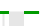
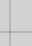

= 图表图例
:allow-uri-read: 
:icons: font
:imagesdir: ../media/

[role="lead"]
用于绘制图表的线条和颜色具有特定的含义。

|===
| 示例 | 含义 

 a| 
image:../media/dark_green_chart_line.gif["显示深绿色线条的屏幕截图"]
 a| 
报告的属性值使用深绿色线绘制。

 a| 
image:../media/light_green_chart_line.gif["屏幕截图显示了指示数据绑带的阴影"]
 a| 
暗绿线周围的浅绿色阴影表示该时间范围内的实际值各不相同，并且已 "`绑定` " 以加快绘制速度。暗线表示加权平均值。绿色的范围表示箱内的最大值和最小值。区域图使用浅棕色阴影来指示容量数据。

 a| 

 a| 
空白区域（未绘制任何数据）表示属性值不可用。背景可以是蓝色，灰色或灰色和蓝色混合，具体取决于报告属性的服务的状态。

 a| 
image:../media/light_blue_chart_shading.gif["屏幕截图显示浅蓝色阴影，表示不确定值"]
 a| 
浅蓝色阴影表示当时的部分或全部属性值不确定；属性未报告值，因为服务处于未知状态。

 a| 

 a| 
灰色阴影表示当时部分或全部属性值未知，因为报告属性的服务已被管理员关闭。

 a| 
image:../media/gray_blue_chart_shading.gif["显示不确定值和未知值混合的屏幕截图"]
 a| 
灰色和蓝色阴影混合表示当时的某些属性值不确定（因为服务处于未知状态），而其他属性值则未知，因为报告属性的服务已被管理员关闭。

|===