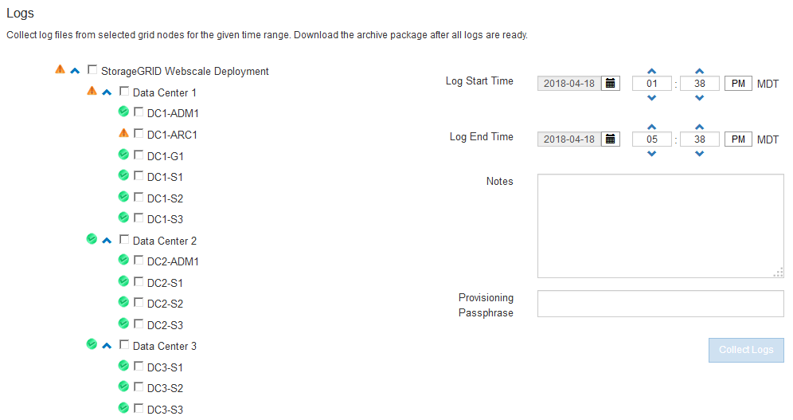

= 收集日志文件和系统数据
:allow-uri-read: 
:icons: font
:imagesdir: ../media/

[role="lead"]
您可以使用网格管理器检索 StorageGRID 系统的日志文件和系统数据（包括配置数据）。

.您需要的内容
* 您必须使用支持的浏览器登录到网格管理器。
* 您必须具有特定的访问权限。
* 您必须具有配置密码短语。

.关于这个主题
您可以使用网格管理器从任何网格节点收集选定时间段的日志文件、系统数据和配置数据。数据会收集并归档在 .tar.gz 文件中，然后可下载到本地计算机。

由于应用程序日志文件可能非常大、因此下载归档日志文件的目标目录必须至少具有1 GB的可用空间。

.步骤
. 选择*支持*>*工具*>*日志*。
+

. 选择要收集日志文件的网格节点。
+
您可以根据需要收集整个网格或整个数据中心站点的日志文件。

. 选择 * 开始时间 * 和 * 结束时间 * 以设置要包含在日志文件中的数据的时间范围。
+
如果选择很长的时间段或从大型网格中的所有节点收集日志，则日志归档可能会变得过大，无法存储在节点上，或者可能会变得过大，无法收集到主管理节点以供下载。如果发生这种情况，您必须使用一组较小的数据重新启动日志收集。

. 也可以在*注释*文本框中键入有关要收集的日志文件的注释。
+
您可以使用这些注释提供有关提示您收集日志文件的问题的技术支持信息。您的注释将添加到名为的文件中 `info.txt`以及有关日志文件收集的其他信息。。 `info.txt` 文件保存在日志文件归档包中。

. 在 * 配置密码短语 * 文本框中输入 StorageGRID 系统的配置密码短语。
. 单击*收集日志*。
+
提交新请求时，系统将删除先前收集的日志文件。

+
image::../media/support_logs_in_progress.gif[正在收集日志：屏幕截图]

+
您可以使用日志页面监控每个网格节点的日志文件收集进度。

+
如果您收到有关日志大小的错误消息，请尝试收集较短时间段或较少节点的日志。

. 日志文件收集完成后、单击*下载*。
+
_.tar.gz_ 文件包含成功收集日志的所有网格节点中的所有日志文件。在组合的 _.tar.gz_ 文件中，每个网格节点有一个日志文件归档。

.完成后
如果需要，您可以稍后重新下载日志文件归档包。

或者、您也可以单击*删除*以删除日志文件归档包并释放磁盘空间。下次收集日志文件时，系统会自动删除当前日志文件归档包。

.相关信息
link:../monitor/logs-files-reference.html["日志文件参考"]
