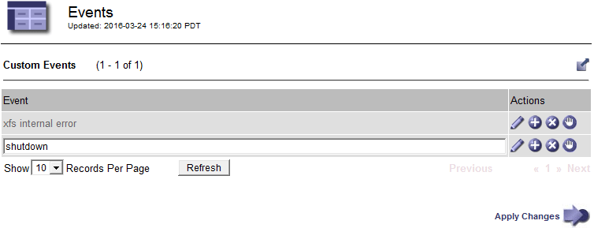

= 创建自定义系统日志事件
:allow-uri-read: 
:icons: font
:imagesdir: ../media/

[role="lead"]
通过自定义事件，您可以跟踪记录到系统日志服务器的所有内核，守护进程，错误和严重级别的用户事件。自定义事件可用于监控系统日志消息的发生情况（进而监控网络安全事件和硬件故障）。

.关于此任务
请考虑创建自定义事件以监控重复出现的问题。以下注意事项适用于自定义事件。

* 创建自定义事件后，系统会监控其每次发生情况。您可以在*节点*>*网格节点_*>*事件*页面上查看所有自定义事件的累积计数值。
* 基于中的关键字创建自定义事件 `/var/log/messages` 或 `/var/log/syslog` 文件、这些文件中的日志必须为：
+
** 由内核生成
** 由守护进程或用户程序在错误或严重级别生成

*注：*中并非所有条目 `/var/log/messages` 或 `/var/log/syslog` 除非文件满足上述要求、否则将匹配这些文件。

.步骤
. 选择*配置*>*监控*>*事件*。
. 单击 * 编辑 * 。 image:../media/icon_nms_edit.gif["铅笔图标"] （或 * 插入 * image:../media/icon_nms_insert.gif["加号图标"] 如果这不是第一个事件）。
. 输入自定义事件字符串，例如 shutdown
+

. 单击 * 应用更改 * 。
. 选择*节点*。然后、选择*网格节点_*>*事件*。
. 在事件表中找到自定义事件条目，并监控 * 计数 * 的值。
+
如果计数增加，则会在该网格节点上触发您正在监控的自定义事件。

+
image::../media/custom_events_count.gif["SMS">" 事件 ">" 概述 " 页面]

