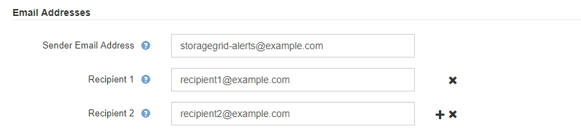

= 管理警报
:allow-uri-read: 
:icons: font
:imagesdir: ../media/

[role="lead"]
通过警报，您可以监控 StorageGRID 系统中的各种事件和状况。您可以通过创建自定义警报，编辑或禁用默认警报，设置警报电子邮件通知以及使警报通知静音来管理警报。

.相关信息
link:viewing-current-alerts.html["查看当前警报"]

link:viewing-resolved-alerts.html["查看已解决的警报"]

link:viewing-specific-alert.html["查看特定警报"]

link:alerts-reference.html["警报参考"]

== 什么是警报

警报系统提供了一个易于使用的界面，用于检测，评估和解决 StorageGRID 运行期间可能发生的问题。

* 警报系统侧重于系统中可操作的问题。与传统系统中的某些警报不同、系统会针对需要立即引起关注的事件触发警报、而不是针对可以安全忽略的事件触发警报。
* " 当前警报 " 页面提供了一个便于用户查看当前问题的界面。您可以按各个警报和警报组对列表进行排序。例如，您可能希望按节点 / 站点对所有警报进行排序，以查看哪些警报正在影响特定节点。或者，您可能希望按触发时间对组中的警报进行排序，以查找特定警报的最新实例。
* " 已解决警报 " 页面提供的信息与 " 当前警报 " 页面上的信息类似，但您可以搜索和查看已解决警报的历史记录，包括警报触发时间和解决时间。
* 同一类型的多个警报会分组到一个电子邮件中，以减少通知数量。此外，同一类型的多个警报将在警报页面上显示为一个组。您可以展开和折叠警报组以显示或隐藏各个警报。例如，如果多个节点报告 "* 无法与节点 * 通信 " 警报大致同时出现，则只会发送一封电子邮件，并且警报会在警报页面上显示为一个组。
* 警报使用直观的名称和说明来帮助您快速了解问题。警报通知包括有关受影响节点和站点的详细信息，警报严重性，触发警报规则的时间以及与警报相关的指标的当前值。
* 警报电子邮件通知以及 " 当前警报 " 和 " 已解决警报 " 页面上的警报列表提供了解决警报的建议操作。这些建议操作通常包括直接链接到 StorageGRID 文档中心，以便于查找和访问更详细的故障排除过程。
* 如果需要在一个或多个严重性级别临时禁止警报通知，您可以轻松地在指定持续时间内对整个网格，单个站点或单个节点静默特定警报规则。您还可以将所有警报规则静默，例如，在软件升级等计划内维护操作步骤 期间。
* 您可以根据需要编辑默认警报规则。您可以完全禁用警报规则，也可以更改其触发条件和持续时间。
* 您可以创建自定义警报规则，以确定与您的情况相关的特定条件，并提供您自己的建议操作。要定义自定义警报的条件，请使用网格管理 API 的 " 指标 " 部分提供的 Prometheus 指标创建表达式。

== 管理警报规则

警报规则用于定义触发特定警报的条件。StorageGRID 包含一组默认警报规则，您可以按原定义使用或修改这些规则，也可以创建自定义警报规则。

=== 查看警报规则

您可以查看所有默认和自定义警报规则的列表，以了解将触发每个警报的条件以及是否已禁用任何警报。

.您需要的内容
* 您必须使用支持的浏览器登录到网格管理器。
* 您必须具有"管理警报"或"根访问"权限。

.步骤
. 选择*警报*>*警报规则*。
+
此时将显示 "Alert Rules" 页面。

+
image::../media/alert_rules_page.png[警报规则页面]

. 查看警报规则表中的信息：
+
|===
| 列标题 | Description 

 a| 
Name
 a| 
警报规则的唯一名称和问题描述 。首先列出自定义警报规则，然后列出默认警报规则。警报规则名称是电子邮件通知的主题。

 a| 
条件
 a| 
用于确定何时触发此警报的 Prometheus 表达式。可以在以下一个或多个严重性级别触发警报，但不需要为每个严重性设置一个条件。

** * 严重 * image:../media/icon_alert_red_critical.png["图标警报红色严重"]：存在已停止 StorageGRID 节点或服务正常运行的异常情况。您必须立即解决底层问题描述 。如果未解决问题描述 ，可能会导致服务中断和数据丢失。
** * 主要 * image:../media/icon_alert_orange_major.png["图标警报橙色主要"]：存在影响当前操作或接近严重警报阈值的异常情况。您应调查主要警报并解决任何根本问题，以确保异常情况不会停止 StorageGRID 节点或服务的正常运行。
** * 次要 * image:../media/icon_alert_yellow_miinor.png["图标警报黄色次要"]：系统运行正常，但存在异常情况，如果系统继续运行，可能会影响系统的运行能力。您应监控和解决自身未清除的小警报，以确保它们不会导致更严重的问题。

 a| 
Type
 a| 
警报规则的类型：

** * 默认 * ：随系统提供的警报规则。您可以禁用默认警报规则或编辑默认警报规则的条件和持续时间。您不能删除默认警报规则。
** * 默认值 * ：包含已编辑条件或持续时间的默认警报规则。根据需要，您可以轻松地将修改后的条件还原回原始默认值。
** * 自定义 * ：创建的警报规则。您可以禁用，编辑和删除自定义警报规则。

 a| 
Status
 a| 
当前是否已启用此警报规则。不会评估已禁用警报规则的条件，因此不会触发任何警报。

|===

.相关信息
link:alerts-reference.html["警报参考"]

=== 创建自定义警报规则

您可以创建自定义警报规则来定义自己触发警报的条件。

.您需要的内容
* 您必须使用支持的浏览器登录到网格管理器。
* 您必须具有"管理警报"或"根访问"权限。

.关于此任务
StorageGRID 不会验证自定义警报。如果您决定创建自定义警报规则，请遵循以下一般准则：

* 查看默认警报规则的条件，并将其用作自定义警报规则的示例。
* 如果为警报规则定义了多个条件，请对所有条件使用相同的表达式。然后，更改每个条件的阈值。
* 仔细检查每个条件是否存在拼写错误和逻辑错误。
* 请仅使用网格管理 API 中列出的指标。
* 在使用网格管理 API 测试表达式时，请注意 " `s成功` " 响应可能只是空响应正文（未触发警报）。要查看警报是否实际触发，您可以临时将阈值设置为您希望当前为 true 的值。
+
例如、用于测试表达式 `node_memory_MemTotal_bytes < 24000000000`、请先执行 `node_memory_MemTotal_bytes >= 0` 并确保获得预期结果(所有节点均返回一个值)。然后，将运算符和阈值改回预期值并重新执行。无结果表明此表达式当前没有警报。

* 除非您验证警报是在预期时间触发的，否则请勿假定自定义警报正在运行。

.步骤
. 选择*警报*>*警报规则*。
+
此时将显示 "Alert Rules" 页面。

. 选择 * 创建自定义规则 * 。
+
此时将显示创建自定义规则对话框。

+
image::../media/alerts_create_custom_rule.png[警报 > 创建自定义规则]

. 选中或取消选中 * 已启用 * 复选框以确定当前是否已启用此警报规则。
+
如果禁用了警报规则，则不会评估其表达式，也不会触发任何警报。

. 输入以下信息：
+
|===
| 字段 | Description 

 a| 
唯一名称
 a| 
此规则的唯一名称。警报规则名称显示在警报页面上，也是电子邮件通知的主题。警报规则的名称可以介于 1 到 64 个字符之间。

 a| 
Description
 a| 
所发生问题的问题描述 。问题描述 是警报页面和电子邮件通知中显示的警报消息。警报规则的说明可以介于 1 到 128 个字符之间。

 a| 
建议的操作
 a| 
也可以选择触发此警报时建议采取的操作。以纯文本格式输入建议的操作（无格式化代码）。警报规则的建议操作可以介于 0 到 1 ， 024 个字符之间。

|===
. 在条件部分中，为一个或多个警报严重性级别输入一个 Prometheus 表达式。
+
基本表达式通常采用以下形式：

+
[listing]
----
[metric] [operator] [value]
----
+
表达式可以是任意长度，但会显示在用户界面的单行上。至少需要一个表达式。

+
要查看可用指标并测试Prometheus表达式、请单击帮助图标 image:../media/icon_nms_question.gif["问号图标"] 并单击网格管理 API 中的指标部分链接。

+
要了解如何使用网格管理API、请参见有关管理StorageGRID 的说明。有关Prometheus查询语法的详细信息、请参见Prometheus文档。

+
如果节点的已安装 RAM 量小于 24 ， 000 ， 000 ， 000 字节（ 24 GB ），则此表达式会触发警报。

+
[listing]
----
node_memory_MemTotal_bytes < 24000000000
----
. 在 * 持续时间 * 字段中，输入在触发警报之前条件必须持续保持有效的时间量，然后选择一个时间单位。
+
要在条件变为 true 时立即触发警报，请输入 * 。增加此值可防止临时条件触发警报。

+
默认值为 5 分钟。

. 单击 * 保存 * 。
+
此时，对话框将关闭，新的自定义警报规则将显示在 "Alert Rules" 表中。

.相关信息
link:../admin/index.html["管理 StorageGRID"]

link:commonly-used-prometheus-metrics.html["常用的 Prometheus 指标"]

https://prometheus.io/docs/querying/basics/["Prometheus：查询基础知识"]

=== 编辑警报规则

您可以编辑警报规则以更改触发条件，对于自定义警报规则，您还可以更新规则名称，问题描述 和建议的操作。

.您需要的内容
* 您必须使用支持的浏览器登录到网格管理器。
* 您必须具有"管理警报"或"根访问"权限。

.关于此任务
编辑默认警报规则时，您可以更改次要警报，主要警报和严重警报的条件以及持续时间。编辑自定义警报规则时，您还可以编辑规则的名称，问题描述 和建议的操作。

IMPORTANT: 决定编辑警报规则时请务必小心。如果更改了触发值，则可能无法检测到潜在问题，直到它阻止完成关键操作为止。

.步骤
. 选择*警报*>*警报规则*。
+
此时将显示 "Alert Rules" 页面。

. 选择要编辑的警报规则对应的单选按钮。
. 选择 * 编辑规则 * 。
+
此时将显示编辑规则对话框。此示例显示了一个默认警报规则— Unique Name ，问题描述 和 Recommended Actions 字段已禁用，无法编辑。

+
image::../media/alert_rules_edit_rule.png[警报 > 编辑规则]

. 选中或取消选中 * 已启用 * 复选框以确定当前是否已启用此警报规则。
+
如果禁用了警报规则，则不会评估其表达式，也不会触发任何警报。

+

NOTE: 如果您对当前警报禁用警报规则，则必须等待几分钟，使警报不再显示为活动警报。

+

IMPORTANT: 通常，不建议禁用默认警报规则。如果禁用了警报规则，则可能无法检测到潜在问题，直到它阻止完成关键操作为止。

. 对于自定义警报规则，请根据需要更新以下信息。
+

NOTE: 您不能为默认警报规则编辑此信息。

+
|===
| 字段 | Description 

 a| 
唯一名称
 a| 
此规则的唯一名称。警报规则名称显示在警报页面上，也是电子邮件通知的主题。警报规则的名称可以介于 1 到 64 个字符之间。

 a| 
Description
 a| 
所发生问题的问题描述 。问题描述 是警报页面和电子邮件通知中显示的警报消息。警报规则的说明可以介于 1 到 128 个字符之间。

 a| 
建议的操作
 a| 
也可以选择触发此警报时建议采取的操作。以纯文本格式输入建议的操作（无格式化代码）。警报规则的建议操作可以介于 0 到 1 ， 024 个字符之间。

|===
. 在条件部分中，输入或更新一个或多个警报严重性级别的 Prometheus 表达式。
+

NOTE: 如果要将已编辑默认警报规则的条件还原为其原始值、请单击已修改条件右侧的三个点。

+
image::../media/alert_rules_edit_revert_to_default.png[警报规则：将已编辑的条件还原为默认值]

+

NOTE: 如果您更新了当前警报的条件，则在解决上一条件之前，可能无法实施您所做的更改。下次满足规则的其中一个条件时，警报将反映更新后的值。

+
基本表达式通常采用以下形式：

+
[listing]
----
[metric] [operator] [value]
----
+
表达式可以是任意长度，但会显示在用户界面的单行上。至少需要一个表达式。

+
要查看可用指标并测试Prometheus表达式、请单击帮助图标 image:../media/icon_nms_question.gif["问号图标"] 并单击网格管理 API 中的指标部分链接。

+
要了解如何使用网格管理API、请参见有关管理StorageGRID 的说明。有关Prometheus查询语法的详细信息、请参见Prometheus文档。

+
如果节点的已安装 RAM 量小于 24 ， 000 ， 000 ， 000 字节（ 24 GB ），则此表达式会触发警报。

+
[listing]
----
node_memory_MemTotal_bytes < 24000000000
----
. 在 * 持续时间 * 字段中，输入在触发警报之前条件必须持续保持有效的时间量，然后选择时间单位。
+
要在条件变为 true 时立即触发警报，请输入 * 。增加此值可防止临时条件触发警报。

+
默认值为 5 分钟。

. 单击 * 保存 * 。
+
如果您编辑了默认警报规则，则 "Type" 列中将显示 "* 默认值 " 。如果禁用了默认或自定义警报规则， * 状态 * 列中将显示 * 已禁用 * 。

.相关信息
link:../admin/index.html["管理 StorageGRID"]

link:commonly-used-prometheus-metrics.html["常用的 Prometheus 指标"]

https://prometheus.io/docs/querying/basics/["Prometheus：查询基础知识"]

=== 禁用警报规则

您可以更改默认或自定义警报规则的启用 / 禁用状态。

.您需要的内容
* 您必须使用支持的浏览器登录到网格管理器。
* 您必须具有"管理警报"或"根访问"权限。

.关于此任务
禁用警报规则后，不会评估其表达式，也不会触发任何警报。

IMPORTANT: 通常，不建议禁用默认警报规则。如果禁用了警报规则，则可能无法检测到潜在问题，直到它阻止完成关键操作为止。

.步骤
. 选择*警报*>*警报规则*。
+
此时将显示 "Alert Rules" 页面。

. 选择要禁用或启用的警报规则对应的单选按钮。
. 选择 * 编辑规则 * 。
+
此时将显示编辑规则对话框。

. 选中或取消选中 * 已启用 * 复选框以确定当前是否已启用此警报规则。
+
如果禁用了警报规则，则不会评估其表达式，也不会触发任何警报。

+

NOTE: 如果您对当前警报禁用警报规则，则必须等待几分钟，以使警报不再显示为活动警报。

. 单击 * 保存 * 。
+
* 已禁用 * 显示在 * 状态 * 列中。

=== 删除自定义警报规则

如果您不想再使用自定义警报规则，可以将其删除。

.您需要的内容
* 您必须使用支持的浏览器登录到网格管理器。
* 您必须具有"管理警报"或"根访问"权限。

.步骤
. 选择*警报*>*警报规则*。
+
此时将显示 "Alert Rules" 页面。

. 选择要删除的自定义警报规则对应的单选按钮。
+
您不能删除默认警报规则。

. 单击*删除自定义规则*。
+
此时将显示确认对话框。

. 单击*确定*以删除警报规则。
+
任何处于活动状态的警报实例将在 10 分钟内得到解决。

== 管理警报通知

触发警报后、StorageGRID 可以发送电子邮件通知和简单网络管理协议(Simple Network Management Protocol、SNMP)通知(陷阱)。

=== 为警报设置SNMP通知

如果您希望 StorageGRID 在发生警报时发送 SNMP 通知，则必须启用 StorageGRID SNMP 代理并配置一个或多个陷阱目标。

.关于此任务
您可以使用网格管理器中的*配置*>*监控*>* SNMP代理*选项或网格管理API的SNMP端点来启用和配置StorageGRID SNMP代理。SNMP 代理支持所有三个版本的 SNMP 协议。

要了解如何配置SNMP代理、请参见有关使用SNMP监控的章节。

配置 StorageGRID SNMP 代理后，可以发送两种类型的事件驱动型通知：

* 陷阱是指 SNMP 代理发送的通知，不需要管理系统确认。陷阱用于通知管理系统 StorageGRID 中发生了某种情况，例如触发警报。所有三个版本的SNMP均支持陷阱
* 通知与陷阱类似，但需要管理系统确认。如果 SNMP 代理未在特定时间内收到确认，则会重新发送通知，直到收到确认或达到最大重试值为止。SNMPv2c 和 SNMPv3 支持 INFORM 。

在任何严重性级别触发默认或自定义警报时，系统都会发送陷阱和通知通知通知。要禁止警报的 SNMP 通知，您必须为此警报配置静默。警报通知由配置为首选发送方的任何管理节点发送。默认情况下，会选择主管理节点。有关详细信息，请参见有关管理 StorageGRID 的说明。

NOTE: 在指定严重性级别或更高级别触发某些警报（传统系统）时，也会发送陷阱和通知通知通知；但是，不会针对每个警报或每个警报严重性发送 SNMP 通知。

.相关信息
link:using-snmp-monitoring.html["使用SNMP监控"]

link:managing-alerts.html["静音警报通知"]

link:../admin/index.html["管理 StorageGRID"]

link:alarms-that-generate-snmp-notifications.html["生成 SNMP 通知的警报（旧系统）"]

=== 为警报设置电子邮件通知

如果您希望在出现警报时发送电子邮件通知，则必须提供有关 SMTP 服务器的信息。您还必须输入警报通知收件人的电子邮件地址。

.您需要的内容
* 您必须使用支持的浏览器登录到网格管理器。
* 您必须具有"管理警报"或"根访问"权限。

.您需要的内容
由于警报和警报是独立的系统，因此用于警报通知的电子邮件设置不会用于警报通知和 AutoSupport 消息。但是，您可以对所有通知使用同一个电子邮件服务器。

如果您的 StorageGRID 部署包含多个管理节点，则可以选择哪个管理节点应是警报通知的首选发送方。警报通知和 AutoSupport 消息也会使用相同的 "`首选发件人` " 。默认情况下，会选择主管理节点。有关详细信息，请参见有关管理 StorageGRID 的说明。

.步骤
. 选择*警报*>*电子邮件设置*。
+
此时将显示电子邮件设置页面。

+
image::../media/alerts_email_setup_disabled.png[已禁用警报电子邮件设置]

. 选中 * 启用电子邮件通知 * 复选框，以指示您希望在警报达到配置的阈值时发送通知电子邮件。
+
此时将显示电子邮件（ SMTP ）服务器，传输层安全（ TLS ），电子邮件地址和筛选器部分。

. 在电子邮件（ SMTP ）服务器部分中，输入 StorageGRID 访问 SMTP 服务器所需的信息。
+
如果 SMTP 服务器需要身份验证，则必须同时提供用户名和密码。您还必须要求使用TLS并提供CA证书。

+
|===
| 字段 | 输入 ... 

 a| 
邮件服务器
 a| 
SMTP 服务器的完全限定域名（ FQDN ）或 IP 地址。

 a| 
Port
 a| 
用于访问 SMTP 服务器的端口。必须介于 1 到 65535 之间。

 a| 
用户名（可选）
 a| 
如果 SMTP 服务器需要身份验证，请输入要进行身份验证的用户名。

 a| 
密码（可选）
 a| 
如果 SMTP 服务器需要身份验证，请输入用于进行身份验证的密码。

|===
+
image:../media/alerts_email_smtp_server.png["警报电子邮件 SMTP 服务器"]

. 在电子邮件地址部分中，输入发件人和每个收件人的电子邮件地址。
+
.. 对于 * 发件人电子邮件地址 * ，请指定一个有效的电子邮件地址，用作警报通知的发件人地址。
+
例如： `storagegrid-alerts@example.com`

.. 在收件人部分中，为每个电子邮件列表或发生警报时应接收电子邮件的人员输入电子邮件地址。
+
单击加号图标 image:../media/icon_plus_sign_black_on_white.gif["加号图标"] 以添加收件人。

+

. 如果与SMTP服务器通信需要传输层安全(TLS)、请在传输层安全(TLS)部分中选中*需要TLS*复选框。
+
.. 在 * CA 证书 * 字段中，提供用于验证 SMTP 服务器标识的 CA 证书。
+
您可以将内容复制并粘贴到此字段中、或者单击*浏览*并选择文件。

+
您必须提供一个文件，其中包含来自每个中间颁发证书颁发机构（ CA ）的证书。此文件应包含 PEM 编码的每个 CA 证书文件，并按证书链顺序串联。

.. 如果 SMTP 电子邮件服务器要求电子邮件发件人提供用于身份验证的客户端证书，请选中 * 发送客户端证书 * 复选框。
.. 在 * 客户端证书 * 字段中，提供 PEM 编码的客户端证书以发送到 SMTP 服务器。
+
您可以将内容复制并粘贴到此字段中、或者单击*浏览*并选择文件。

.. 在 * 专用密钥 * 字段中，输入未加密 PEM 编码的客户端证书的专用密钥。
+
您可以将内容复制并粘贴到此字段中、或者单击*浏览*并选择文件。

+

NOTE: 如果需要编辑电子邮件设置、请单击铅笔图标以更新此字段。

+
image::../media/alerts_email_tls.png[警报电子邮件 TLS]

. 在筛选器部分中，选择应导致电子邮件通知的警报严重性级别，除非特定警报的规则已被静音。
+
|===
| severity | Description 

 a| 
次要，重大，严重
 a| 
满足警报规则的次要，主要或严重条件时，系统会发送电子邮件通知。

 a| 
主要，关键
 a| 
当满足警报规则的主要或关键条件时，系统会发送电子邮件通知。不会针对次要警报发送通知。

 a| 
仅严重
 a| 
只有在满足警报规则的严重条件时，才会发送电子邮件通知。对于次要或主要警报，不会发送通知。

|===
+
image:../media/alerts_email_filters.png["警报电子邮件筛选器"]

. 准备好测试电子邮件设置后，请执行以下步骤：
+
.. 单击*发送测试电子邮件*。
+
此时将显示一条确认消息，指示已发送测试电子邮件。

.. 检查所有电子邮件收件人的收件箱，确认已收到测试电子邮件。
+

NOTE: 如果在几分钟内未收到电子邮件，或者触发了 * 电子邮件通知失败 * 警报，请检查您的设置并重试。

.. 登录到任何其他管理节点并发送测试电子邮件以验证所有站点的连接。
+

NOTE: 在测试警报通知时，您必须登录到每个管理节点以验证连接。这与测试警报通知和 AutoSupport 消息不同，所有管理节点都会发送测试电子邮件。

. 单击 * 保存 * 。
+
发送测试电子邮件不会保存您的设置。必须单击*保存*。

+
此时将保存电子邮件设置。

.相关信息
link:managing-alerts.html["对警报电子邮件通知进行故障排除"]

link:../maintain/index.html["保持并恢复()"]

=== 警报电子邮件通知中包含的信息

配置 SMTP 电子邮件服务器后，在触发警报时，系统会向指定的收件人发送电子邮件通知，除非警报规则被静默禁止。

电子邮件通知包括以下信息：

image::../media/alerts_email_notification.png[警报电子邮件通知]

[cols="1a,5a"]
|===
|  | Description 

 a| 
1.
 a| 
警报名称，后跟此警报的活动实例数。

 a| 
2.
 a| 
警报的问题描述 。

 a| 
3.
 a| 
为警报建议的任何操作。

 a| 
4.
 a| 
有关警报的每个活动实例的详细信息，包括受影响的节点和站点，警报严重性，触发警报规则的 UTC 时间以及受影响作业和服务的名称。

 a| 
5.
 a| 
发送通知的管理节点的主机名。

|===
.相关信息
link:managing-alerts.html["静音警报通知"]

=== StorageGRID 组如何在电子邮件通知中发出警报

为了防止在触发警报时发送过多的电子邮件通知， StorageGRID 会尝试在同一通知中对多个警报进行分组。

有关 StorageGRID 如何在电子邮件通知中对多个警报进行分组的示例，请参见下表。

|===
| 行为 | 示例 

 a| 
每个警报通知仅适用于同名警报。如果同时触发两个名称不同的警报，则会发送两封电子邮件通知。
 a| 
* 警报 A 会同时在两个节点上触发。仅发送一个通知。
* 节点 1 上触发警报 A ，节点 2 上同时触发警报 B 。系统会发送两个通知—每个警报一个。

 a| 
对于特定节点上的特定警报，如果达到阈值的严重性超过一个，则仅针对最严重警报发送通知。
 a| 
* 此时将触发警报 A ，并达到次要，主要和严重警报阈值。系统会为严重警报发送一条通知。

 a| 
首次触发警报时， StorageGRID 会等待 2 分钟，然后再发送通知。如果在此期间触发了其他同名警报，则 StorageGRID 会在初始通知中对所有警报进行分组。​
 a| 
. 节点 1 上的警报 A 在 08 ： 00 触发。不会发送任何通知。
. 节点 2 上的警报 A 在 08 ： 01 触发。不会发送任何通知。
. 8 ： 02 发送通知以报告两个警报实例。

 a| 
如果触发另一个同名警报， StorageGRID 将等待 10 分钟，然后再发送新通知。新通知会报告所有活动警报（当前未静音的警报），即使先前已报告这些警报也是如此。
 a| 
. 节点 1 上的警报 A 在 08 ： 00 触发。通知在 08 ： 02 发送。
. 节点 2 上的警报 A 在 08 ： 05 触发。第二个通知将在 8 ： 15 （ 10 分钟后）发送。此时将报告这两个节点。

 a| 
如果当前存在多个同名警报且其中一个警报已解决，则在已解决警报的节点上重新出现此警报时，不会发送新通知。
 a| 
. 已针对节点 1 触发警报 A 。此时将发送通知。
. 已针对节点 2 触发警报 A 。此时将发送第二个通知。
. 已解决节点 2 的警报 A ，但此警报对于节点 1 仍处于活动状态。
. 此时将再次触发节点 2 的警报 A 。不会发送任何新通知，因为此警报对于节点 1 仍处于活动状态。

 a| 
StorageGRID 会继续每 7 天发送一次电子邮件通知，直到所有警报实例均已解决或警报规则已静音为止。
 a| 
. 3 月 8 日为节点 1 触发警报 A 。此时将发送通知。
. 警报 A 未解决或静音。其他通知将于 3 月 15 日， 3 月 22 日， 3 月 29 日等时间发送。

|===

=== 对警报电子邮件通知进行故障排除

如果触发了 * 电子邮件通知失败 * 警报，或者您无法收到测试警报电子邮件通知，请按照以下步骤解决问题描述 。

.您需要的内容
* 您必须使用支持的浏览器登录到网格管理器。
* 您必须具有"管理警报"或"根访问"权限。

.步骤
. 验证设置。
+
.. 选择*警报*>*电子邮件设置*。
.. 验证电子邮件（ SMTP ）服务器设置是否正确。
.. 验证您是否为收件人指定了有效的电子邮件地址。

. 检查垃圾邮件筛选器，确保电子邮件未发送到垃圾文件夹。
. 请您的电子邮件管理员确认不会阻止来自发件人地址的电子邮件。
. 收集管理节点的日志文件，然后联系技术支持。
+
技术支持可以使用日志中的信息帮助确定出现问题的原因。例如， prometheus.log 文件在连接到您指定的服务器时可能会显示错误。

.相关信息
link:collecting-log-files-and-system-data.html["收集日志文件和系统数据"]

== 静音警报通知

或者，您也可以配置静音以临时禁止警报通知。

.您需要的内容
* 您必须使用支持的浏览器登录到网格管理器。
* 您必须具有"管理警报"或"根访问"权限。

.关于此任务
您可以对整个网格，单个站点或单个节点以及一个或多个严重性静默警报规则。每次静默都将禁止针对单个警报规则或所有警报规则发出所有通知。

如果已启用 SNMP 代理，则 Silences 还会禁止 SNMP 陷阱并通知。

IMPORTANT: 在决定静默警报规则时，请务必小心。如果您静默警报，则可能无法检测到潜在问题，直到它阻止完成关键操作为止。

NOTE: 由于警报和警报是独立的系统，因此不能使用此功能禁止警报通知。

.步骤
. 选择*警报*>*静音*。
+
此时将显示 Silences 页面。

+
image::../media/alerts_silences_page.png[警报 > 静音页面]

. 选择 * 创建 * 。
+
此时将显示创建静默对话框。

+
image::../media/alerts_create_silence.png[警报 > 创建静默]

. 选择或输入以下信息：
+
[cols="1a,3a"]
|===
| 字段 | Description 

 a| 
警报规则
 a| 
要静默的警报规则的名称。您可以选择任何默认或自定义警报规则，即使警报规则已禁用也是如此。

* 注： * 如果要使用此对话框中指定的标准将所有警报规则静默，请选择 * 所有规则 * 。

 a| 
Description
 a| 
也可以选择静默问题描述 。例如，请描述此静默的目的。

 a| 
Duration
 a| 
希望此静默保持有效的时间，以分钟，小时或天为单位。静默时间为 5 分钟到 1 ， 825 天（ 5 年）。

* 注意： * 不应将警报规则静默较长时间。如果某个警报规则已静音，则在阻止完成关键操作之前，您可能无法检测到潜在问题。但是，如果警报是由特定的有意配置触发的，则可能需要使用长时间静默，例如， "* 服务设备链路已关闭 " 警报和 "* 存储设备链路已关闭 " 警报可能会出现这种情况。

 a| 
severity
 a| 
应将哪个警报严重性或严重性静音。如果在选定严重性之一触发警报，则不会发送任何通知。

 a| 
节点
 a| 
您希望此静默应用于哪个或哪些节点。您可以禁止整个网格，单个站点或单个节点上的警报规则或所有规则。如果选择整个网格，则会将适用场景 静默所有站点和所有节点。如果选择站点，则此静默状态仅适用于该站点上的节点。

* 注意： * 每次静默不能选择多个节点或多个站点。如果要同时在多个节点或多个站点上禁止相同的警报规则，则必须创建其他静音。

|===
. 单击 * 保存 * 。
. 如果要在静默过期之前修改或结束静默，可以对其进行编辑或删除。
+
[cols="1a,3a"]
|===
| 选项 | Description 

 a| 
编辑静默
 a| 
.. 选择*警报*>*静音*。
.. 从表中，选择要编辑的静默设置对应的单选按钮。
.. 单击 * 编辑 * 。
.. 更改问题描述 ，剩余时间，选定严重性或受影响的节点。
.. 单击 * 保存 * 。

 a| 
取消静默
 a| 
.. 选择*警报*>*静音*。
.. 从表中，选择要删除的静默设置对应的单选按钮。
.. 单击 * 删除 * 。
.. 单击*确定*确认要删除此静默状态。
+
* 注意 * ：现在，在触发此警报时，系统将发送通知（除非被另一个静默禁止）。如果当前触发此警报，则发送电子邮件或 SNMP 通知以及更新警报页面可能需要几分钟的时间。

|===

.相关信息
link:configuring-snmp-agent.html["配置SNMP代理"]
