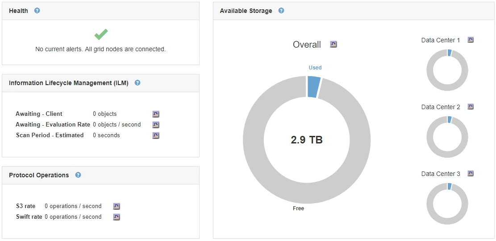

= 监控整个网格的存储容量
:allow-uri-read: 
:icons: font
:imagesdir: ../media/

[role="lead"]
您必须监控网格的整体存储容量，以确保为对象数据和对象元数据保留足够的可用空间。了解存储容量如何随时间变化有助于您计划在占用网格的可用存储容量之前添加存储节点或存储卷。

.您需要的内容
您必须使用支持的浏览器登录到网格管理器。

.关于此任务
通过网格管理器中的信息板，您可以快速评估整个网格和每个数据中心的可用存储容量。节点页面提供了对象数据和对象元数据的更详细值。

.步骤
. 评估可用于整个网格和每个数据中心的存储量。
+
.. 选择 * 信息板 * 。
.. 在可用存储面板中，记下可用存储容量和已用存储容量的总体摘要。
+

NOTE: 此摘要不包括归档介质。

+

.. 将光标置于图表的 " 可用容量 " 或 " 已用容量 " 部分上方，可准确查看可用空间量或已用空间量。
+
image::../media/storage_capacity_used.gif[信息板可用容量或已用容量图表]

.. 对于多站点网格，请查看每个数据中心的图表。
.. 单击图表图标 image:../media/icon_chart_new.gif["图表图标"] 用于查看整体图表或单个数据中心的图形，以显示一段时间内的容量使用情况。
+
显示已用存储容量百分比（ % ）与的图形此时将显示时间。

. 确定已使用的存储容量以及仍可用于对象数据和对象元数据的存储容量。
+
.. 选择*节点*。
.. 选择 * ； grid_* > * 存储 * 。
+
image::../media/nodes_deployment_storage_tab.png[节点部署存储选项卡]

.. 将光标悬停在"已用存储-对象数据"和"已用存储-对象元数据"图表上、可查看整个网格可使用的对象存储和对象元数据存储容量以及已使用的容量。
+

NOTE: 站点或网格的总值不包括至少在五分钟内未报告指标的节点，例如脱机节点。

. 按照技术支持的指示、查看有关网格存储容量的其他详细信息。
+
.. 选择*支持*>*工具*>*网格拓扑*。
.. 选择*；grid_*>*概述*>*主要*。
+
image::../media/system_wide_storage_capacity.gif[系统级存储容量—网格拓扑树]

. 计划执行扩展，以便在占用网格的可用存储容量之前添加存储节点或存储卷。
+
在规划扩展时间时，请考虑购买和安装额外存储需要多长时间。

+

NOTE: 如果您的 ILM 策略使用纠删编码，则您可能希望在现有存储节点已满大约 70% 时进行扩展，以减少必须添加的节点数量。

+
有关规划存储扩展的详细信息，请参见有关扩展 StorageGRID 的说明。

.相关信息
link:../expand/index.html["扩展网格"]
