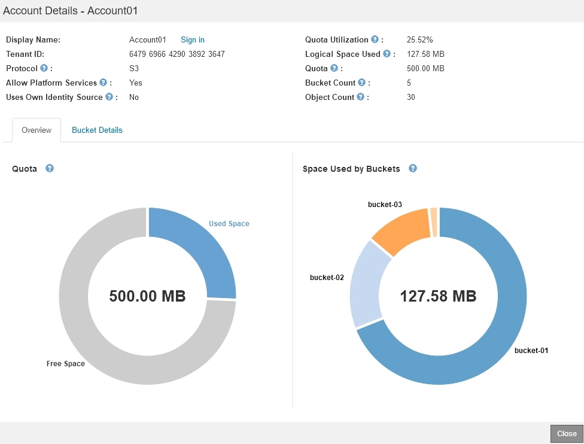
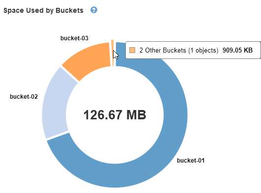

= 监控租户活动
:allow-uri-read: 
:icons: font
:imagesdir: ../media/

[role="lead"]
所有客户端活动都与租户帐户相关联。您可以使用网格管理器监控租户的存储使用情况或网络流量，也可以使用审核日志或 Grafana 信息板收集有关租户如何使用 StorageGRID 的更多详细信息。

.您需要的内容
* 您必须使用支持的浏览器登录到网格管理器。
* 您必须具有root访问权限或管理员权限。

.关于此任务

IMPORTANT: " 已用空间 " 值是估计值。这些估计值受载入时间，网络连接和节点状态的影响。

.步骤
. 选择*租户*可查看所有租户使用的存储量。
+
列出了每个租户的已用空间、配额利用率、配额和对象计数。如果未为租户设置配额、则配额利用率字段包含一个短划线(-)、而配额字段则指示"`无限制。`

+
image::../media/tenant_accounts_page.png[租户帐户页面]

+
如果您的系统包含20个以上的项目、则可以指定一次在每个页面上显示的行数。使用搜索框按显示名称或租户ID搜索租户帐户。

+
您可以通过在表的*登录*列中选择链接来登录到租户帐户。

. 或者，选择 * 导出到 CSV* 以查看和导出包含所有租户的使用量值的 .csv 文件。
+
系统将提示您打开或保存 `.csv` 文件

+
.csv 文件的内容如下所示：

+
image::../media/tenant_accounts_example_csv.png[租户帐户示例 .csv]

+
您可以在电子表格应用程序中打开 .csv 文件，也可以在自动化环境中使用该文件。

. 要查看特定租户的详细信息、包括使用情况图表、请从租户帐户页面中选择租户帐户、然后选择*查看详细信息*。
+
此时将显示"Account Details"页面、其中显示了摘要信息、一个图表表示已用配额量和剩余配额量、另一个图表表示存储分段(S3)或容器(Swift)中的对象数据量。

+

+
** *配额*
+
如果为此租户设置了配额、则*配额*图表将显示此租户已使用的配额量以及仍可用的配额量。如果未设置配额、则租户的配额将无限制、并会显示一条信息性消息。如果租户超过存储配额 1% 以上且至少超过 1 GB ，则此图表将显示总配额和超额量。

+
您可以将光标置于已用空间段上方、以查看已存储对象的数量以及已用总字节数。您可以将光标置于可用空间段上方、以查看可用存储配额的字节数。

+

IMPORTANT: 配额利用率基于内部估计值，在某些情况下可能会超出此值。例如，当租户开始上传对象时， StorageGRID 会检查配额，如果租户超过配额，则会拒绝新的载入。但是，在确定是否超过配额时， StorageGRID 不会考虑当前上传的大小。如果删除对象，则可能会暂时阻止租户上传新对象，直到重新计算配额利用率为止。配额利用率计算可能需要 10 分钟或更长时间。

+

NOTE: 租户的配额利用率表示租户已上传到 StorageGRID 的对象数据总量（逻辑大小）。配额利用率并不表示用于存储这些对象及其元数据副本的空间（物理大小）。

+

NOTE: 您可以启用 * 租户配额使用量高 * 警报，以确定租户是否正在使用其配额。如果启用，则在租户已使用其配额的 90% 时触发此警报。有关详细信息，请参见警报参考。

** *已用空间*
+
"*分段使用的空间*(S3)"或"*容器使用的空间*(Swift)"图表显示租户的最大分段。已用空间是指存储分段中的对象数据总量。此值不表示 ILM 副本和对象元数据所需的存储空间。

+
如果租户具有九个以上的分段或容器、则它们将合并为一个称为"其他"的分段。某些图表区块可能太小、无法包含标签。您可以将光标置于任何分段上方、以查看标签并获取更多信息、包括存储的对象数量以及每个分段或容器的总字节数。

+

. 选择*分段详细信息*(S3)或*容器详细信息*(Swift)可查看每个租户的分段或容器的已用空间和对象数量列表。
+
image::../media/tenant_bucket_details.png[租户存储分段详细信息]

. 或者，也可以选择 * 导出到 CSV* 以查看和导出包含每个分段或容器的使用量值的 .csv 文件。
+
系统将提示您打开或保存.csv文件。

+
单个 S3 租户的 .csv 文件的内容如下所示：

+
image::../media/tenant_bucket_details_csv.png[租户存储分段详细信息 CSV 示例]

+
您可以在电子表格应用程序中打开 .csv 文件，也可以在自动化环境中使用该文件。

. 如果某个租户已设置流量分类策略，请查看该租户的网络流量。
+
.. 选择*配置*>*网络设置*>*流量分类*。
+
此时将显示 " 流量分类策略 " 页面，并在表中列出现有策略。

+
image::../media/traffic_classification_policies_main_screen_w_examples.png[图形的流量策略示例]

.. 查看策略列表以确定适用于特定租户的策略。
.. 要查看与策略关联的指标，请选择策略左侧的单选按钮，然后单击 * 指标 * 。
.. 分析图形以确定策略限制流量的频率以及是否需要调整策略。
+
要创建，编辑或删除流量分类策略，请参见有关管理 StorageGRID 的说明。

. 或者，也可以使用审核日志更精细地监控租户的活动。
+
例如，您可以监控以下类型的信息：

+
** 特定客户端操作，例如 PUT ， GET 或 DELETE
** 对象大小
** 应用于对象的 ILM 规则
** 客户端请求的源 IP

+
审核日志会写入文本文件，您可以使用所选的日志分析工具进行分析。这样，您可以更好地了解客户活动，或者实施复杂的成本分摊和计费模式。有关详细信息，请参见了解审核消息的说明。

. 或者，也可以使用 Prometheus 指标报告租户活动：
+
** 在网格管理器中、选择*支持*>*工具*>*指标*。您可以使用现有信息板（如 S3 概述）查看客户端活动。
+

IMPORTANT: 指标页面上提供的工具主要供技术支持使用。这些工具中的某些功能和菜单项会有意失效。

** 选择*帮助*>* API文档*。您可以使用网格管理 API 的 " 指标 " 部分中的指标为租户活动创建自定义警报规则和信息板。

.相关信息
link:alerts-reference.html["警报参考"]

link:../audit/index.html["查看审核日志"]

link:../admin/index.html["管理 StorageGRID"]

link:reviewing-support-metrics.html["查看支持指标"]
