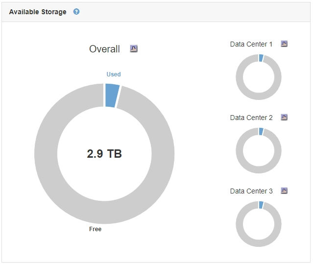
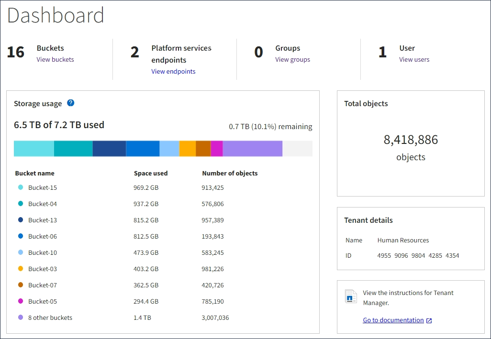

= 图表和图形的类型
:allow-uri-read: 
:icons: font
:imagesdir: ../media/

[role="lead"]
图表和图形汇总了特定 StorageGRID 指标和属性的值。

网格管理器信息板包含饼图(圆环)、用于汇总网格和每个站点的可用存储。

租户管理器信息板上的存储使用情况面板显示以下内容：

* 租户最大的分段（ S3 ）或容器（ Swift ）列表
* 一个条形图，表示最大分段或容器的相对大小
* 已用总空间量，如果设置了配额，则还会显示剩余空间量和百分比

此外、还可以从节点页面和*支持*>*工具*>*网格拓扑*页面查看显示StorageGRID 指标和属性随时间变化的图形。

图形有四种类型：

* * 格拉法纳图表 * ：如节点页面上所示，格拉法纳图表用于绘制一段时间内的 Prometheus 指标值。例如、管理节点的*节点*>*负载平衡器*选项卡包含四个Grafana图表。
+
image::../media/nodes_page_load_balancer_tab.png[节点页面负载平衡器选项卡]

+

NOTE: Grafana图表也包含在预构建的信息板中、这些信息板可从*支持*>*工具*>*指标*页面获得。

* *折线图*：可从节点页面和*支持*>*工具*>*网格拓扑*页面(单击图表图标 image:../media/icon_chart_new.gif["图标图表（新增）"] 在数据值之后，使用折线图绘制具有单位值（例如 NTP 频率偏移，以 PPM 为单位）的 StorageGRID 属性值。值的更改会按定期数据间隔（箱）绘制。
+
image::../media/line_graph.gif[折线图]

* *区域图形*：可从节点页面和*支持*>*工具*>*网格拓扑*页面访问(单击图表图标 image:../media/icon_chart_new.gif["图标图表（新增）"] 在数据值之后，使用分区图绘制容量属性数量，例如对象计数或服务负载值。区域图形与折线图类似，但在折线下方会显示浅棕色阴影。值的更改会按定期数据间隔（箱）绘制。
+
image::../media/area_graph.gif[区域图形]

* 某些图形使用不同类型的图表图标表示 image:../media/icon_chart_new_for_11_5.png["图表图标—11.5新增"] 格式不同：
+
image::../media/charts_lost_object_detected.png[检测到图表丢失对象]

* *状态图*：可从*支持*>*工具*>*网格拓扑*页面访问(单击图表图标 image:../media/icon_chart_new.gif["图标图表（新增）"] 在数据值之后，状态图用于绘制表示不同状态的属性值，例如服务状态可以是联机，备用或脱机。状态图与折线图类似，但过渡不连续，即值从一个状态值跳到另一个状态值。
+
image::../media/state_graph.gif[状态图]

.相关信息
link:viewing-nodes-page.html["查看节点页面"]

link:viewing-grid-topology-tree.html["查看网格拓扑树"]

link:reviewing-support-metrics.html["查看支持指标"]
