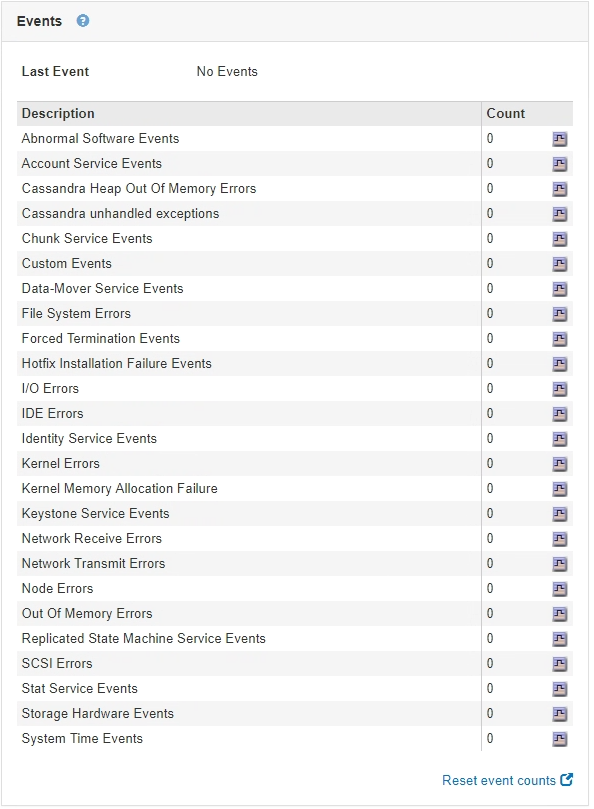

= 查看事件选项卡
:allow-uri-read: 
:icons: font
:imagesdir: ../media/

[role="lead"]
事件选项卡可显示节点的任何系统错误或故障事件计数、包括网络错误等错误。

此时将显示所有节点的事件选项卡。

如果特定节点出现问题、您可以使用事件选项卡了解有关问题描述 的更多信息。技术支持还可以使用事件选项卡上的信息帮助进行故障排除。

您可以从事件选项卡执行以下任务：

* 使用表顶部的*最后一个事件*字段显示的信息确定最近发生的事件。
* 单击图表图标 image:../media/icon_chart_new.gif["图表图标"] 查看某个特定事件在一段时间内发生的时间。
* 解决任何问题后、将事件计数重置为零。

.相关信息
link:monitoring-events.html["监控事件"]

link:displaying-charts-and-graphs.html["显示图表和图形"]

link:resetting-event-counts.html["正在重置事件计数"]
