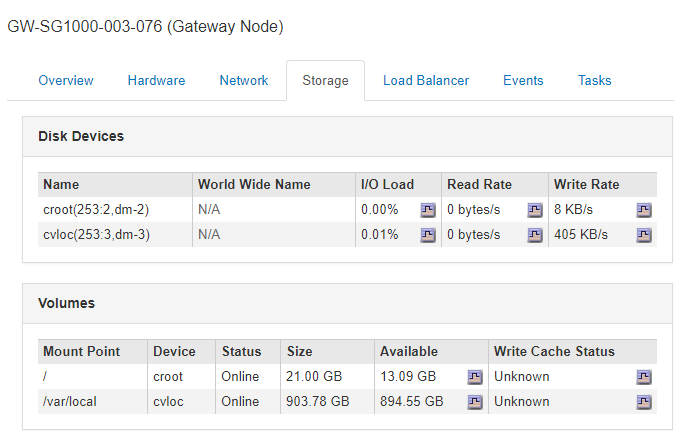

= 查看有关设备管理节点和网关节点的信息
:allow-uri-read: 
:icons: font
:imagesdir: ../media/

[role="lead"]
节点页面列出了有关管理节点或网关节点所使用的每个服务设备的服务运行状况以及所有计算、磁盘设备和网络资源的信息。您还可以查看内存，存储硬件，网络资源，网络接口，网络地址， 以及接收和传输数据。

.步骤
. 从节点页面中，选择设备管理节点或设备网关节点。
. 选择 * 概述 * 。
+
"概述"选项卡上的"节点信息"表显示节点的ID和名称、节点类型、安装的软件版本以及与节点关联的IP地址。接口列包含接口的名称、如下所示：

+
** * adllb* 和 * adlli* ：如果对管理网络接口使用主动 / 备份绑定，则显示此信息
** * eth * ：网格网络，管理网络或客户端网络。
** * hic* ：设备上的一个物理 10 ， 25 或 100 GbE 端口。这些端口可以绑定在一起，并连接到 StorageGRID 网格网络（ eth0 ）和客户端网络（ eth2 ）。
** * MTC*：设备上的一个物理1 GbE端口、可以绑定或别名并连接到StorageGRID 管理网络(eth1)。image:../media/nodes_page_overview_tab_services_appliance.png["服务设备的节点页面概述选项卡"]

. 选择 * 硬件 * 可查看有关此设备的详细信息。
+
.. 查看 CPU 利用率和内存图形，确定 CPU 和内存使用量随时间的变化所占百分比。要显示不同的时间间隔，请选择图表或图形上方的控件之一。您可以显示间隔为 1 小时， 1 天， 1 周或 1 个月的可用信息。您还可以设置自定义间隔，以便指定日期和时间范围。
+
image::../media/nodes_page_hardware_tab_graphs_services_appliance.png[服务设备的节点页面硬件选项卡图形]

.. 向下滚动以查看设备组件表。此表包含型号名称，序列号，控制器固件版本以及每个组件的状态等信息。
+
image::../media/nodes_page_hardware_tab_services_appliance_do_not_use.png[服务设备的节点页面硬件选项卡]

+
|===
| 字段 | Description 

 a| 
设备型号
 a| 
此 StorageGRID 设备的型号。

 a| 
存储控制器故障驱动器计数
 a| 
非最佳驱动器的数量。

 a| 
存储数据驱动器类型
 a| 
设备中的驱动器类型，例如 HDD （硬盘驱动器）或 SSD （固态驱动器）。

 a| 
存储数据驱动器大小
 a| 
包括设备中所有数据驱动器的总容量。

 a| 
存储RAID模式
 a| 
设备的 RAID 模式。

 a| 
整体电源
 a| 
设备中所有电源的状态。

 a| 
计算控制器BMC IP
 a| 
计算控制器中的基板管理控制器（ Baseboard Management Controller ， BMC ）端口的 IP 地址。您可以使用此 IP 连接到 BMC 界面来监控和诊断设备硬件。

对于不包含 BMC 的设备型号，不会显示此字段。

 a| 
计算控制器序列号
 a| 
计算控制器的序列号。

 a| 
计算硬件
 a| 
计算控制器硬件的状态。

 a| 
计算控制器 CPU 温度
 a| 
计算控制器 CPU 的温度状态。

 a| 
计算控制器机箱温度
 a| 
计算控制器的温度状态。

|===
.. 确认所有状态均为 "`标称值。` "
+
如果状态不是 "`标称，` " ，请查看任何当前警报。

. 选择 * 网络 * 可查看每个网络的信息。
+
网络流量图提供了整体网络流量的摘要。

+
image::../media/nodes_page_network_traffic_graph.gif[节点页面网络流量图]

+
.. 查看网络接口部分。
+
image::../media/nodes_page_hardware_tab_network_services_appliance.png[节点页面硬件选项卡网络服务设备]

+
使用下表以及网络接口表中 * 速度 * 列中的值确定设备上的四个 40/100-GbE 网络端口是否配置为使用主动 / 备份模式或 LACP 模式。

+

NOTE: 表中显示的值假定使用了所有四个链路。

+
|===
| 链路模式 | 绑定模式 | 单个 HIC 链路速度（ hic1 ， hic2 ， hic3 ， hic4 ） | 预期网格 / 客户端网络速度（ eth0 ， eth2 ） 

 a| 
聚合
 a| 
LACP
 a| 
100
 a| 
400

 a| 
已修复
 a| 
LACP
 a| 
100
 a| 
200

 a| 
已修复
 a| 
主动 / 备份
 a| 
100
 a| 
100

 a| 
聚合
 a| 
LACP
 a| 
40
 a| 
160

 a| 
已修复
 a| 
LACP
 a| 
40
 a| 
80

 a| 
已修复
 a| 
主动 / 备份
 a| 
40
 a| 
40

|===
.. 查看网络通信部分。
+
接收和传输表显示了通过每个网络接收和发送的字节数和数据包数，以及其他接收和传输指标。

+
image::../media/nodes_page_network_communication.gif[节点页面网络通信]

. 选择 * 存储 * 可查看有关服务设备上的磁盘设备和卷的信息。
+

.相关信息
link:../sg100-1000/index.html["SG100和AMP；SG1000服务设备"]
