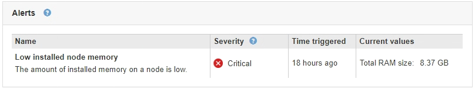

= 查看概述选项卡
:allow-uri-read: 
:icons: font
:imagesdir: ../media/

[role="lead"]
概述选项卡提供了有关每个节点的基本信息。此外，它还会显示当前影响节点的任何警报。

此时将显示所有节点的概述选项卡。

== 节点信息

概述选项卡的节点信息部分列出了有关网格节点的基本信息。

image::../media/nodes_page_overview_tab.png[节点页面概述选项卡]

节点的概述信息包括：

* * 名称 * ：分配给节点并显示在网格管理器中的主机名。
* *类型*：节点的类型—管理节点、存储节点、网关节点或归档节点。
* * ID * ：节点的唯一标识符，也称为 UUID 。
* *连接状态*：三种状态之一。此时将显示最严重状态的图标。
+
** * 未连接 - 未知 * image:../media/icon_alarm_blue_unknown.png["蓝色问号图标"]：节点未连接到网格，原因未知。例如，节点之间的网络连接已断开或电源已关闭。此外，可能还会触发 * 无法与节点 * 通信 " 警报。其他警报可能也处于活动状态。这种情况需要立即引起关注。
+

NOTE: 在受管关闭操作期间，节点可能会显示为未知。在这些情况下，您可以忽略未知状态。

** * 未连接 - 已管理员关闭 * image:../media/icon_alarm_gray_administratively_down.png["灰色问号图标"]：由于预期原因，节点未连接到网格。例如，节点或节点上的服务已正常关闭，节点正在重新启动或软件正在升级。一个或多个警报可能也处于活动状态。
** * 已连接 * image:../media/icon_alert_green_checkmark.png["图标警报绿色复选标记"]：节点已连接到网格。

* *软件版本*：节点上安装的StorageGRID 版本。
* * HA组*：仅适用于管理节点和网关节点。如果节点上的网络接口包含在高可用性组中、并且该接口是主接口还是备份接口、则显示此信息。
+
image::../media/ha_group_master_interface.png[HA组主接口]

* * IP地址*：节点的IP地址。单击*显示更多*以查看节点的IPv4和IPv6地址以及接口映射：
+
** Eth0：网格网络
** Eth1：管理网络
** Eth2：客户端网络

== 警报

" 概述 " 选项卡的 " 警报 " 部分列出了当前影响此节点且尚未静音的所有警报。单击警报名称可查看其他详细信息和建议的操作。

.相关信息
link:monitoring-node-connection-states.html["监控节点连接状态"]

link:viewing-current-alerts.html["查看当前警报"]

link:viewing-specific-alert.html["查看特定警报"]
