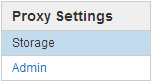

= 配置网络设置
:allow-uri-read: 
:icons: font
:imagesdir: ../media/

[role="lead"]
您可以从网格管理器配置各种网络设置，以微调 StorageGRID 系统的运行。

== 域名

如果您计划支持 S3 虚拟托管模式请求，则必须配置 S3 客户端连接到的端点域名列表。例如、s3.example.com、s3.example.co.uk和s3-east.example.com。

NOTE: 配置的服务器证书必须与端点域名匹配。

== 高可用性组

高可用性组使用虚拟IP地址(VIP)为网关节点或管理节点服务提供主动备份访问。HA组由管理节点和网关节点上的一个或多个网络接口组成。创建HA组时、您可以选择属于网格网络(eth0)或客户端网络(eth2)的网络接口。

NOTE: 管理网络不支持HA VIP。

HA组维护一个或多个虚拟IP地址、这些地址会添加到组中的活动接口中。如果活动接口不可用、则虚拟IP地址将移至另一个接口。此故障转移过程通常只需几秒钟，并且速度足以使客户端应用程序不会受到任何影响，并且可以依靠正常的重试行为继续运行。

出于多种原因、您可能希望使用高可用性(HA)组。

* HA 组可以为网格管理器或租户管理器提供高度可用的管理连接。
* HA 组可以为 S3 和 Swift 客户端提供高可用性数据连接。
* 如果 HA 组仅包含一个接口，则可以提供多个 VIP 地址并明确设置 IPv6 地址。

== 链路成本

您可以调整链路成本以反映站点之间的延迟。如果存在两个或更多数据中心站点，则链路成本会优先考虑应由哪个数据中心站点提供请求的服务。

== 负载平衡器端点

您可以使用负载平衡器处理从 S3 和 Swift 客户端载入和检索工作负载。负载平衡通过在多个存储节点之间分布工作负载和连接来最大限度地提高速度和连接容量。

如果要使用管理节点和网关节点上包含的 StorageGRID 负载平衡器服务，则必须配置一个或多个负载平衡器端点。每个端点都为 S3 和 Swift 向存储节点发出的请求定义了一个网关节点或管理节点端口。

== 代理设置

如果您使用的是 S3 平台服务或云存储池，则可以在存储节点和外部 S3 端点之间配置非透明代理服务器。如果使用 HTTPS 或 HTTP 发送 AutoSupport 消息，则可以在管理节点和技术支持之间配置非透明代理服务器。

== 服务器证书

您可以上传两种类型的服务器证书：

* 管理接口服务器证书、用于访问管理接口的证书。
* 对象存储API服务端点服务器证书、用于保护S3和Swift端点的安全、以便直接连接到存储节点或在网关节点上使用CLB服务。
+

NOTE: CLB 服务已弃用。

负载平衡器证书在负载平衡器端点页面上进行配置。密钥管理服务器(Key Management Server、KMS)证书在密钥管理服务器页面上进行配置。

== 流量分类策略

通过流量分类策略、您可以创建规则来识别和处理不同类型的网络流量、包括与特定分段、租户、客户端子网或负载平衡器端点相关的流量。这些策略有助于限制和监控流量。

== 不可信的客户端网络

如果您使用的是客户端网络，则可以通过指定每个节点上的客户端网络不可信来帮助保护 StorageGRID 免受恶意攻击。如果节点的客户端网络不可信，则节点仅接受显式配置为负载平衡器端点的端口上的入站连接。

例如，您可能希望网关节点拒绝客户端网络上除 HTTPS S3 请求之外的所有入站流量。或者，您可能希望启用来自存储节点的出站 S3 平台服务流量，同时防止客户端网络上与该存储节点的任何入站连接。

.相关信息
link:../admin/index.html["管理 StorageGRID"]

link:managing-tenants-and-client-connections.html["管理租户和客户端连接"]
