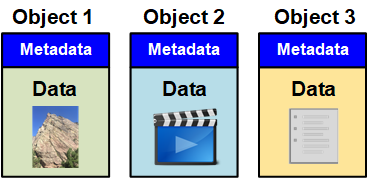

= 什么是对象
:allow-uri-read: 
:icons: font
:imagesdir: ../media/

[role="lead"]
对于对象存储，存储单元是对象，而不是文件或块。与文件系统或块存储的树状层次结构不同，对象存储以非结构化的平面布局对数据进行组织。对象存储可将数据的物理位置与用于存储和检索数据的方法分离。

基于对象的存储系统中的每个对象都有两部分：对象数据和对象元数据。

== 对象数据

对象数据可以是任何内容；例如，照片，电影或病历。

== 对象元数据

对象元数据是指描述对象的任何信息。StorageGRID 使用对象元数据跟踪网格中所有对象的位置，并管理每个对象的生命周期。

对象元数据包括以下信息：

* 系统元数据，包括每个对象的唯一 ID （ UUID ），对象名称， S3 存储分段或 Swift 容器的名称，租户帐户名称或 ID ，对象的逻辑大小，首次创建对象的日期和时间， 以及上次修改对象的日期和时间。
* 每个对象副本或纠删编码片段的当前存储位置。
* 与对象关联的任何用户元数据。

对象元数据可自定义并可扩展，因此应用程序可以灵活地使用。

有关 StorageGRID 如何以及在何处存储对象元数据的详细信息，请转到 link:../admin/managing-object-metadata-storage.html["管理对象元数据存储"]。
