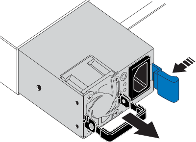

= 更换服务设备中的电源
:allow-uri-read: 
:icons: font
:imagesdir: ../media/

[role="lead"]
此服务设备具有两个电源以实现冗余。如果其中一个电源发生故障，您必须尽快更换，以确保设备具有冗余电源。

.您需要的内容
* 您已卸载替代电源设备。
* 您已在数据中心找到要更换电源的物理设备。
+
link:locating-controller-in-data-center.html["在数据中心中查找控制器"]

* 您可以确认另一个电源已安装且正在运行。

.关于此任务
此图显示了 SG100 的两个电源设备，这些设备可从设备背面访问。

image::../media/sg1000_power_supplies.png[带有两个电源的 SG100 的背面]

NOTE: SG1000 的电源相同。

.步骤
. 从电源拔下电源线。
. 提起凸轮把手。
+
image::../media/sg6000_cn_lift_cam_handle_psu.gif[提起凸轮把手以卸下SG1000 PSU]

. 按下蓝色闩锁并拉出电源。
+

. 将替代电源滑入机箱。
+
在滑入设备时，请确保蓝色闩锁位于右侧。

+
image::../media/sg6000_cn_insert_power_supply.gif[将电源滑入SG1000]

. 向下推凸轮把手以固定电源。
. 将电源线连接到电源，并确保绿色 LED 亮起。

