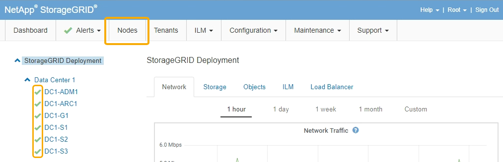

= 使用维护模式升级存储控制器上的SANtricity 操作系统
:allow-uri-read: 
:icons: font
:imagesdir: ../media/

[role="lead"]
对于当前使用的 SANtricity 操作系统版本早于 08.42.20.00 （ 11.42 ）的存储控制器，您必须使用维护模式操作步骤 来应用升级。

.您需要的内容
* 您已查阅 NetApp 互操作性表工具（ IMT ）以确认用于升级的 SANtricity 操作系统版本与您的设备兼容。
* 如果 StorageGRID 设备在 StorageGRID 系统中运行，则 SG6000-CN 控制器已置于维护模式。
+

NOTE: 维护模式会中断与存储控制器的连接。

+
link:placing-appliance-into-maintenance-mode.html["将设备置于维护模式"]

.关于此任务
请勿一次在多个 StorageGRID 设备上升级 E 系列控制器中的 SANtricity 操作系统或 NVSRAM 。

IMPORTANT: 一次升级多个 StorageGRID 设备可能会导致发生原因 数据不可用，具体取决于您的部署模式和 ILM 策略。

.步骤
. 从服务笔记本电脑访问 SANtricity 系统管理器并登录。
. 将新的 SANtricity OS 软件文件和 NVSRAM 文件下载到管理客户端。
+

IMPORTANT: NVSRAM 是特定于 StorageGRID 设备的。请勿使用标准 NVSRAM 下载。

. 按照 _upgrading SANtricity OS_ 指南或 SANtricity 系统管理器联机帮助中的说明升级固件和 NVSRAM 。
+

NOTE: 立即激活升级文件。请勿延迟激活。

. 升级操作完成后、重新启动节点。在 StorageGRID 设备安装程序中，选择 * 高级 * > * 重新启动控制器 * ，然后选择以下选项之一：
+
** 选择 * 重新启动到 StorageGRID * 以在节点重新加入网格的情况下重新启动控制器。如果您已完成维护模式下的工作并准备好将节点恢复正常运行，请选择此选项。
** 选择 * 重新启动至维护模式 * 以重新启动控制器，同时使节点仍处于维护模式。如果在重新加入网格之前需要对节点执行其他维护操作、请选择此选项。image:../media/reboot_controller_from_maintenance_mode.png["在维护模式下重新启动控制器"]
+
设备重新启动并重新加入网格可能需要长达 20 分钟的时间。要确认重新启动已完成且节点已重新加入网格，请返回网格管理器。"*节点*"选项卡应显示正常状态 image:../media/icon_alert_green_checkmark.png["图标警报绿色复选标记"] 对于设备节点、表示没有处于活动状态的警报、并且节点已连接到网格。

+

.相关信息
https://["NetApp 互操作性表工具"^]

link:upgrading-santricity-os-on-storage-controllers-using-grid-manager-sg6000.html["使用网格管理器升级存储控制器上的SANtricity 操作系统"]
