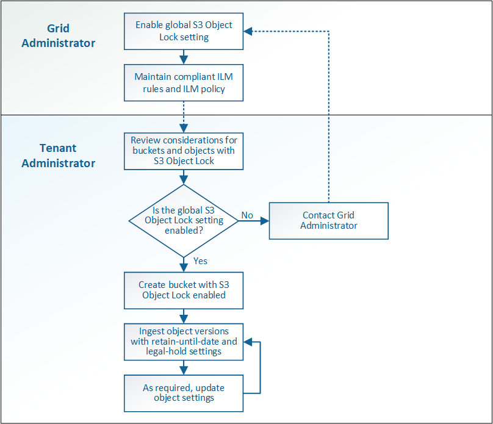

= S3 对象锁定工作流
:allow-uri-read: 
:icons: font
:imagesdir: ../media/

[role="lead"]
工作流图显示了在 StorageGRID 中使用 S3 对象锁定功能的高级步骤。

在启用了 S3 对象锁定的情况下创建分段之前，网格管理员必须为整个 StorageGRID 系统启用全局 S3 对象锁定设置。网格管理员还必须确保信息生命周期管理(ILM)策略"`compliant`"；它必须满足启用了S3对象锁定的分段的要求。有关详细信息，请联系网格管理员或查看有关通过信息生命周期管理来管理对象的说明。

启用全局 S3 对象锁定设置后，您可以在启用了 S3 对象锁定的情况下创建存储分段。然后，您可以使用 S3 客户端应用程序为每个对象版本指定保留设置。

.相关信息
link:../ilm/index.html["使用 ILM 管理对象"]
