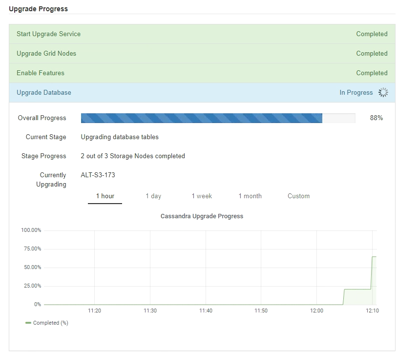

= 升级网格节点并完成升级
:allow-uri-read: 
:icons: font
:imagesdir: ../media/

[role="lead"]
升级主管理节点后、您必须升级StorageGRID 系统中的所有其他网格节点。您可以通过选择升级单个网格节点、网格节点组或所有网格节点来自定义升级顺序。

.步骤
. 查看软件升级页面上的升级进度部分、其中提供了有关每个主要升级任务的信息。
+
.. * 启动升级服务 * 是第一个升级任务。在此任务期间，软件文件将分发到网格节点，并启动升级服务。
.. 完成 * 启动升级服务 * 任务后， * 升级网格节点 * 任务将启动。
.. 在执行 * 升级网格节点 * 任务期间，将显示网格节点状态表，其中显示了系统中每个网格节点的升级阶段。

. 在网格节点状态表中显示网格节点后、在批准任何网格节点之前、请下载恢复软件包的新副本。
+

IMPORTANT: 升级主管理节点上的软件版本后，必须下载恢复软件包文件的新副本。通过恢复包文件，您可以在发生故障时还原系统。

. 查看网格节点状态表中的信息。网格节点按管理节点， API 网关节点，存储节点和归档节点等类型按部分进行排列。
+
image::../media/software_upgrade_start_grid_node_status.gif[管理节点完成后升级网格节点的屏幕截图]

+
首次显示此页面时，网格节点可能处于以下阶段之一：

+
** Done （完成）（仅限主管理节点）
** 正在准备升级
** 软件下载已排队
** 正在下载
** 正在等待您批准

. 批准已准备好添加到升级队列的网格节点。相同类型的已批准节点将一次升级一个。
+
如果节点升级顺序非常重要，请逐个批准节点或节点组，并等待每个节点完成升级，然后再批准下一个节点或节点组。

+

IMPORTANT: 在网格节点上开始升级时，该节点上的服务将停止。稍后，网格节点将重新启动。对于与节点通信的客户端，这些操作可能会导致发生原因 服务中断。除非您确定节点已准备好停止并重新启动、否则请勿批准节点升级。

+
** 选择一个或多个 * 批准 * 按钮将一个或多个单独的节点添加到升级队列。
** 在每个部分中选择 * 全部批准 * 按钮，将所有相同类型的节点添加到升级队列。
** 选择顶级 * 全部批准 * 按钮，将网格中的所有节点添加到升级队列。

. 如果需要从升级队列中删除一个或所有节点、请选择*删除*或*全部删除*。
+
如示例所示、当阶段达到*正在停止服务*时、*删除*按钮将处于隐藏状态、您无法再删除此节点。

+
image::../media/software_upgrade_two_nodes_queued.gif[显示 Stage 正在停止服务的屏幕截图]

. 等待每个节点继续完成升级阶段、包括已排队、停止服务、停止容器、清理Docker映像、升级基础操作系统软件包、重新启动和启动服务。
+

NOTE: 当设备节点达到升级基本操作系统软件包阶段时，设备上的 StorageGRID 设备安装程序软件将会更新。此自动化过程可确保 StorageGRID 设备安装程序版本与 StorageGRID 软件版本保持同步。

+
升级完所有网格节点后、*升级网格节点*任务将显示为已完成。其余升级任务将在后台自动执行。

. 一旦完成*启用功能*任务(此任务会很快发生)、您就可以开始使用升级后的StorageGRID 版本中的新功能。
+
例如、如果要升级到StorageGRID 11.5、则现在可以启用S3对象锁定、配置密钥管理服务器或增加元数据预留空间设置。

+
link:increasing-metadata-reserved-space-setting.html["增加元数据预留空间设置"]

. 定期监控*升级数据库*任务的进度。
+
在此任务期间、系统会升级每个存储节点上的Cassandra数据库。

+

NOTE: 完成*升级数据库*任务可能需要数天时间。在运行此后台任务时、您可以应用修补程序或恢复节点。但是、在执行扩展或停用操作步骤 之前、您必须等待*最终升级步骤*任务完成。

+
您可以查看此图以监控每个存储节点的进度。

+

. 完成 * 升级数据库 * 任务后，请等待几分钟，以完成 * 最终升级步骤 * 任务。
+
image::../media/software_upgrade_final_upgrade_steps.png[最终升级步骤]

+
完成最终升级步骤任务后，将完成升级。

. 确认升级已成功完成。
+
.. 使用支持的浏览器登录到网格管理器。
.. 选择*帮助*>*关于*。
.. 确认显示的版本符合您的预期。
.. 选择 * 维护 * > * 系统 * > * 软件更新 * 。然后、选择* StorageGRID Upgrade*。
.. 确认绿色横幅显示软件升级已在您预期的日期和时间完成。
+
image::../media/software_upgrade_done.png[软件升级已完成]

. 验证网格操作是否已恢复正常：
+
.. 检查这些服务是否正常运行，以及是否没有意外警报。
.. 确认客户端与 StorageGRID 系统的连接是否按预期运行。

. 查看StorageGRID 的"NetApp下载"页面、了解是否为您刚刚安装的StorageGRID 版本提供了任何修补程序。
+
https://["NetApp 下载： StorageGRID"^]

+
在 StorageGRID 11.5. _x.y_ 版本号中：

+
** 主要版本的_x_值为0 (11.5.0)。
** 次要版本的_x_值不是0 (例如11.5.1)(如果可用)。
** 修补程序(如果有)具有_y_值(例如11.5.0.1)。

. 如果有、请下载并应用适用于您的StorageGRID 版本的最新修补程序。
+
有关应用修补程序的信息、请参见恢复和维护说明。

.相关信息
link:downloading-recovery-package.html["正在下载恢复包"]

link:../maintain/index.html["保持并恢复()"]
